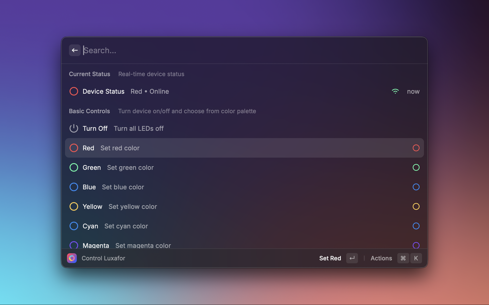

<a name="readme-top"></a>

<div align="center">
    
  <h3 align="center">Luxafor Controller</h3>
  <p align="center">
    Control your Luxafor LED device directly from Raycast with real-time status monitoring and quick color controls.
  <br />
  <a href="./ROADMAP.md"><strong>Explore the roadmap »</strong></a>
  <br />
  </p>
</div>

<details>
  <summary>Table of Contents</summary>

- [About The Project](#about-the-project)
  - [Features](#features)
  - [Built With](#built-with)
- [Getting Started](#getting-started)
  - [Prerequisites](#prerequisites)
  - [Install](#install)
  - [Usage](#usage)
- [Back Matter](#back-matter)
  - [Roadmap](#roadmap)
  - [Contributing](#contributing)
  - [License](#license)

</details>

## About The Project
<div align="center">
    
  </div>

**Luxafor Controller** is a Raycast extension that provides direct control over your Luxafor LED device. Control colors and monitor device status from both the main interface and your menubar. Perfect for developers, streamers, or anyone who wants quick access to their Luxafor device controls.

### Features

- **Basic Controls**: Turn device on/off, set solid colors (red, green, blue, yellow, cyan, magenta, white)
- **Blink Effects**: Make your device blink with any of the basic colors
- **Connection Testing**: Test if your device is reachable and monitor health
- **Easy Configuration**: Simple setup with your Luxafor User ID and API endpoint selection
- **Menubar Status**: Real-time status indicator in your menubar showing current color and device status
- **Global State Management**: Keeps menubar and main UI in sync with smart auto-refresh

### Built With

- TypeScript + React
- `@raycast/api`, `@raycast/utils`
- Axios for HTTP requests
- Local storage for state persistence

## Getting Started

### Prerequisites

- Raycast installed on macOS
- Luxafor device (Flag, Orb, Bluetooth Pro, etc.)
- Luxafor software running with Webhook mode enabled
- Your Luxafor User ID from the Webhook tab

### Install

1. Install the extension from the Raycast Store
2. Open Raycast preferences
3. Go to Extensions → Luxafor Controller
4. Enter your Luxafor User ID
5. Choose your preferred API endpoint (US or UK)

### Usage

#### Main Control Interface
- **Control Luxafor**: Full control interface with all color options
- **Color Selection**: Choose from 7 basic colors or turn off
- **Blink Effects**: Add blinking animations to any color
- **Connection Testing**: Verify device connectivity
- **Health Monitoring**: Check device status and connection health

#### Menubar Integration
- **Luxafor Status**: Real-time color indicator in your menubar
- **Quick Actions**: Toggle between red/green or access full color palette
- **Status Monitoring**: See online/offline status at a glance
- **Auto-refresh**: Updates every 30 seconds without interrupting user actions

## Commands

### Control Luxafor
Main interface for controlling your device with full color options and patterns.

### Luxafor Status (Menubar)
Shows real-time device status in your menubar:
- **Color indicator**: Shows current device color with matching icon tint
- **Online/offline status**: Real-time connection status
- **Quick actions**: Turn off, set red/green/blue directly from menubar
- **Customise**: Choose from a simple red/green toggle menu or a colorful menu
- **Last action**: Shows what was last performed
- **Auto-refresh**: Updates every 30 seconds (won't overwrite recent user actions)

## Setup

1. **Get your Luxafor User ID**:
   - Open Luxafor software
   - Go to the "Webhook" tab
   - Copy your User ID

2. **Configure the extension**:
   - Open Raycast preferences
   - Go to Extensions → Luxafor Controller
   - Enter your User ID
   - Choose your preferred API endpoint

3. **Enable menubar status** (optional):
   - The "Luxafor Status" command will appear in your menubar
   - Shows current device color and status
   - Provides quick access to common actions

## Notes

- This extension uses the official Luxafor Webhook API. It cannot read the device's actual LED state; instead, it tracks the most recent action and avoids auto-refresh from clobbering your choice.
- If the Luxafor app is not running or webhook mode is disabled, requests will fail.

## Troubleshooting

- Ensure your **User ID** is correct (from the Luxafor app → Webhook tab)
- Verify the chosen **API endpoint** matches your region
- Keep the **Luxafor app running** (Webhook mode)
- Try **Test Connection** to verify connectivity
- If actions succeed but LEDs don't change, replug the device and restart the Luxafor app

## Supported Devices

- Luxafor Flag (Tested to work)
- Luxafor Colorblind Flag  
- Luxafor Orb
- Luxafor Bluetooth Pro
- Luxafor Bluetooth

## API Endpoints

- `api.luxafor.com` (US)
- `api.luxafor.co.uk` (UK)

## Development

```bash
npm install
npm run dev
```

## Building

```bash
npm run build
```

## References

- Luxafor Webhook API basics and endpoints: [Help Scout Docs](https://luxafor.helpscoutdocs.com/article/25-webhook-api-basics-and-guidelines), [Luxafor UK](https://luxafor.co.uk/webhook-api/)

## Back Matter

### Roadmap

See [ROADMAP.md](./ROADMAP.md) for planned features and improvements.

### Contributing

Contributions are welcome! Please feel free to submit a Pull Request.

### License

Distributed under the MIT License. See [`LICENSE`](./LICENSE) for more information.