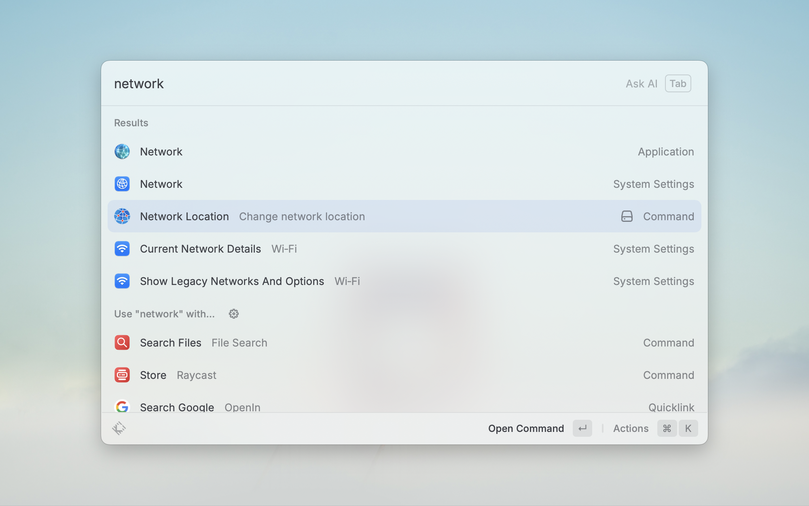
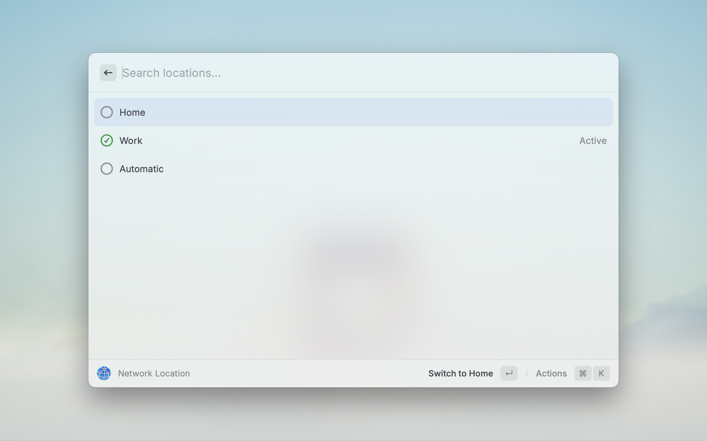

# macOS Network Location Changer

[](https://raycast.com/)

A Raycast extension to **list and switch between your macOS Network Locations** directly from Raycast.

---

## ✨ Features

-  🔄 Instantly switch between all configured macOS network locations
-  🖥️ See which location is currently active
-  ⚡ Refresh the list after a change
-  🧑‍💻 No need to open System Settings or use Terminal

---

## 📸 Screenshots

| Overview                                                 | List of Locations/Switch Confirmation                      |
|----------------------------------------------------------|------------------------------------------------------------|
|  |  |

---

## 🚀 How to Use

1. Open Raycast and search for `Network Location`
2. Browse and select your desired network location
3. Press `Enter` to switch
4. Optionally, use the **Refresh** action to reload the list

---

## 🛠️ Requirements

-  **macOS** (tested on Sonoma)
-  **Network Locations** set up in System Settings > Network

---

## ⚙️ Installation

### From Raycast Store
> _Coming soon!_

### Manual (Development)

```bash
git clone https://github.com/raycast/extensions.git
cd raycast-mac-network-location-changer
npm install
raycast dev
