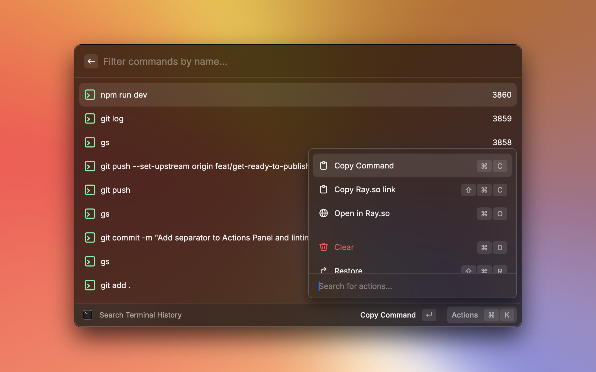
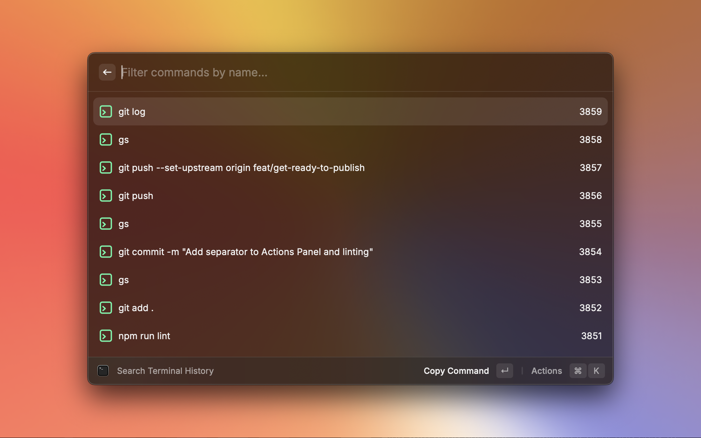
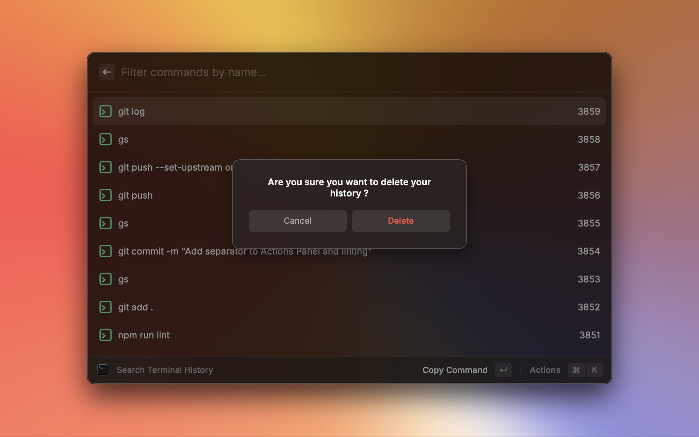
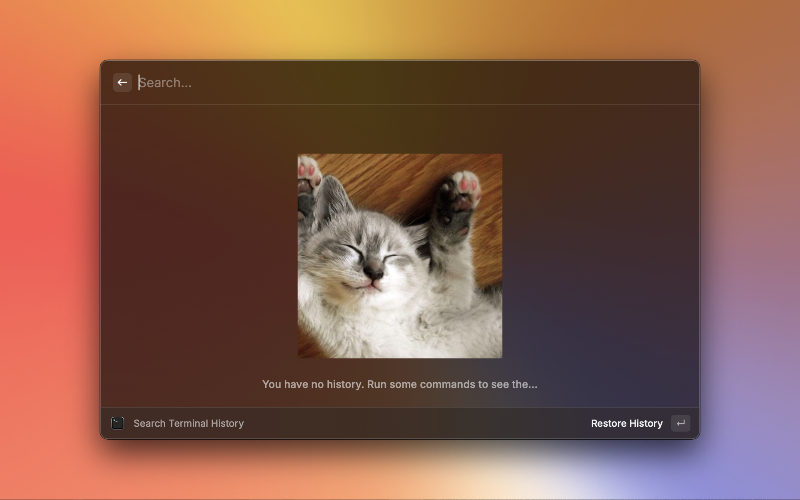

# macOS Utilities

A group of command items that are accessed via the command line like toggling clamshell mode, seeing your history and many many more...

Have the ability to search your git history and copy a command right in raycast.

