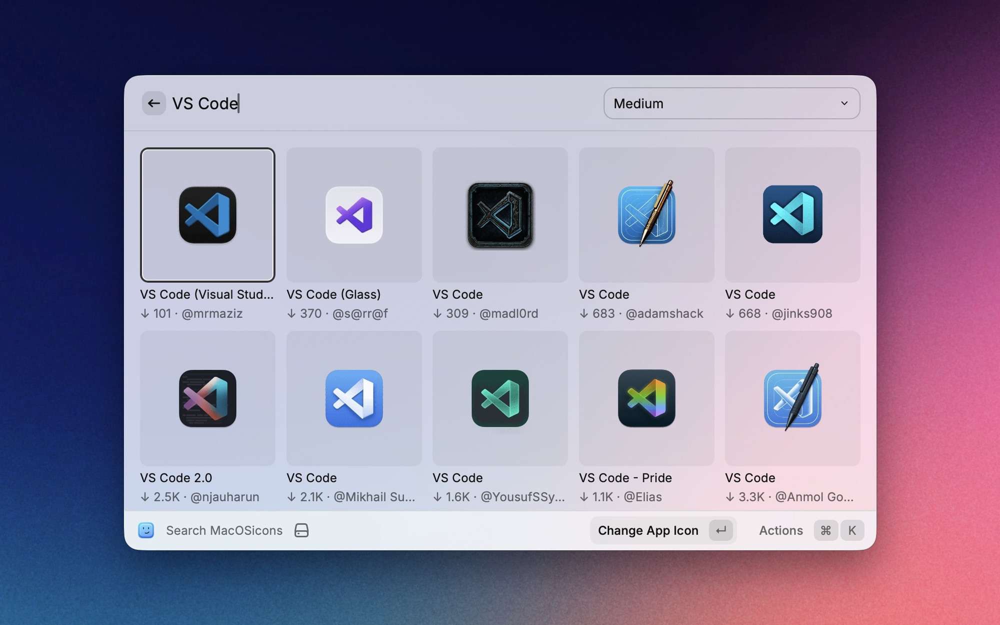
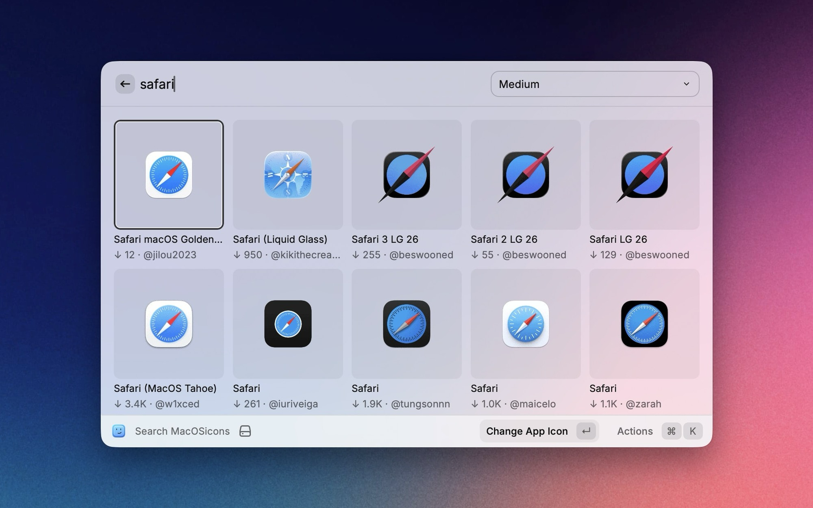
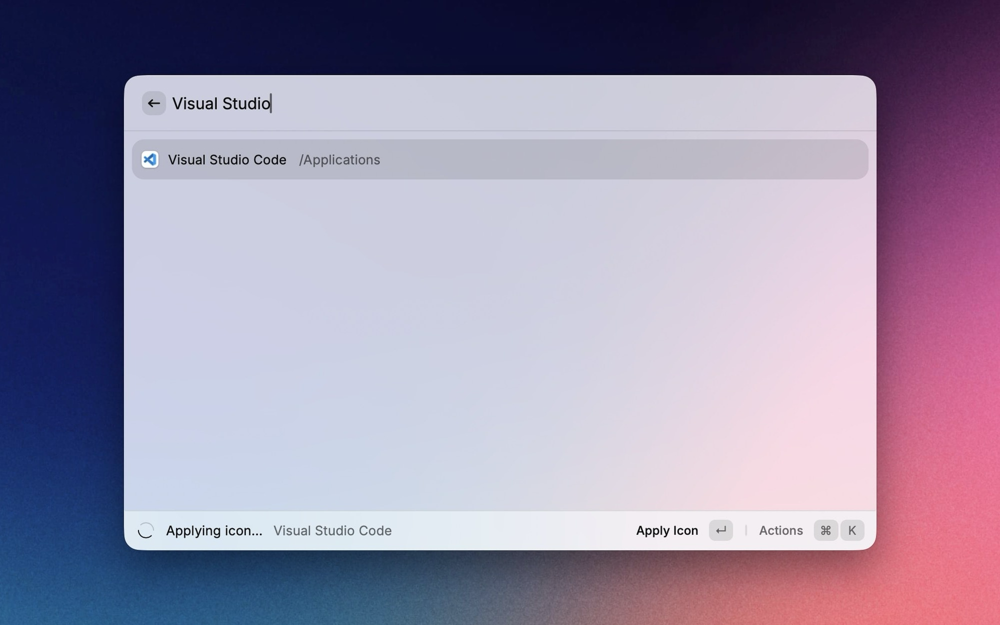

# macOSicons

Browse and apply thousands of beautiful macOS app icons directly from Raycast — no browser required.

## Features

- **Search Icons** — Instantly search the full [macOSicons.com](https://macosicons.com) library
- **Apply Icons** — Change any installed app's icon with a single action (macOS prevents changing Apple's own apps' icons programmatically)
- **Reset Icons** — Restore an app's original icon at any time
- **Download ICNS** — Download `.icns` files directly from Raycast
- **View API Usage** — Track your monthly and all-time API usage, and see how close you are to the free-tier limit

## Screenshots

| Search                                     | Grid View                         | Apply Icon                          |
| ------------------------------------------ | --------------------------------- | ----------------------------------- |
|  |  |  |

## Setup

The extension needs an API key to talk to macOSicons.com. You can get one in two ways.

### Option 1: Sign in with your macOSicons.com account (recommended)

Open the **Search Icons** command. If you're not signed in, you'll see a **Sign in with MacOSicons.com** action — run it and a browser window opens to authorize Raycast. Once you approve, the extension generates and stores a free API key for you automatically. No copy-pasting required.

Don't have an account yet? Create a free one at [macosicons.com](https://macosicons.com) first.

### Option 2: Paste an API key (power users)

If you'd rather manage the key yourself, open **Raycast → Extensions → MacOSicons** and paste your key into the **API Key** preference. When set, this key takes priority over browser sign-in, and the Sign in / Sign out actions are hidden.

## API limits

The extension is powered by the public macOSicons.com API. The **free tier** includes:

- **50 requests per month** (each search counts as one request)
- **2 requests per second**

You can check your current usage any time with the **View API Usage** command. If you need more, upgrading raises your limits and helps support the ongoing development of macOSicons — a free, open library of community-made icons. Learn more at [docs.macosicons.com](https://docs.macosicons.com).

## Preferences

| Preference  | Description                                                                                                                     |
| ----------- | ------------------------------------------------------------------------------------------------------------------------------- |
| **API Key** | Optional. Paste an API key from your macOSicons.com account to skip browser sign-in. If set, it takes priority over signing in. |
