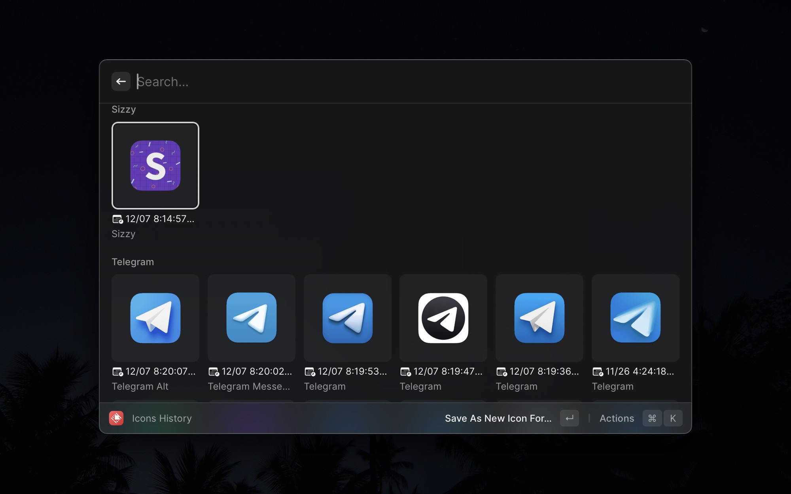

# MacOSIcons.com

Raycast extension for browsing and applying icons from [macOSicons.com](https://macosicons.com)

There's a command to see whole your history of icon changes made through the extension. You can easily compare them side by side, revert back if you made a mistake and much more!

##### Many thanks macOSicons for having such a great product out there for free! <3

_P.S. if you have any questions, or you found my usage of any available resources wrong or possibly inappropriate, please let me know right away!_
