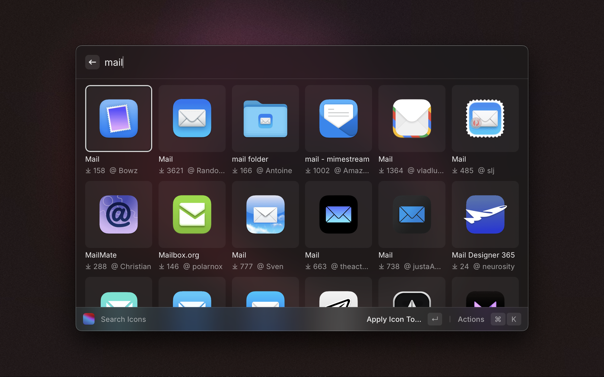
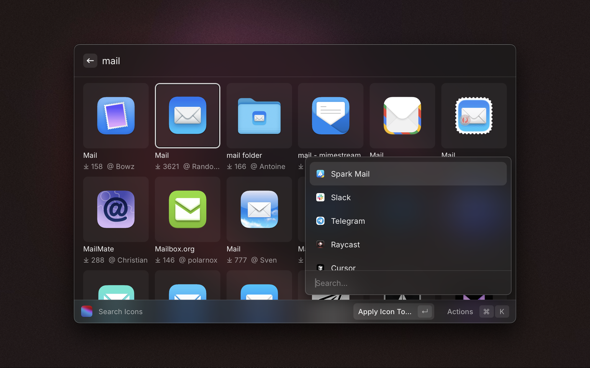
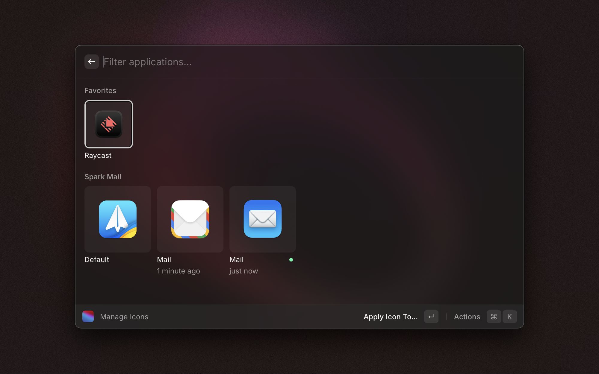

# MacOSIcons.com

Raycast extension for browsing and applying icons from [macOSicons.com](https://macosicons.com)

## Getting Started

To use this extension, you'll need an API key from macOSicons.com:

1. Visit [macOSicons API Management](https://docs.macosicons.com/api-management)
2. Follow the instructions to create an account or log in to an existing one
3. Copy the API key

Install the extension. The first time you run the `Search Icons` command, it will prompt you for your API key.

#### `Search Icons`

Updating an application's icon is straightforward:

1. Find an icon you like, select it, and press `Enter` (or choose the 'Apply Icon' action).

2. Choose the application whose icon you want to change:
   

3. And voilà! Your new icon is applied.
   

> [!NOTE]
> Due to macOS limitations, application updates will revert the icon to its default. A fix for this is currently under development.

#### `Manage Icons`

This command displays previously applied icons, allowing you to easily switch between them or revert to the default icon.

_Experiment here to see which icons look best in your setup._

**A big thank you to [macOSicons.com](https://macosicons.com) for their fantastic product!**

> _P.S. If you have any questions or concerns about the use of resources, please feel free to reach out._
