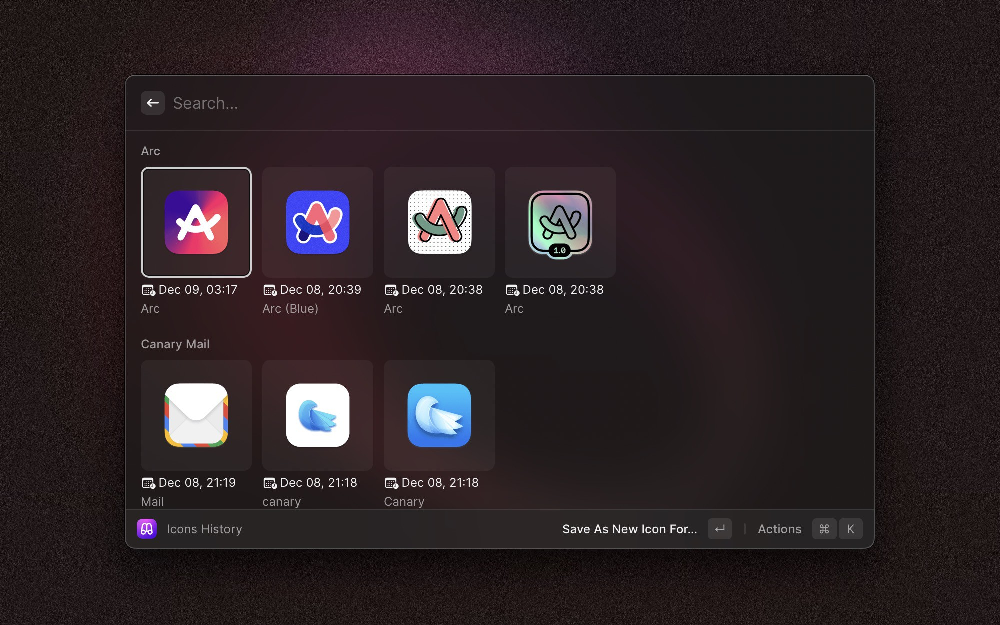

# MacOSIcons.com

Raycast extension for browsing and applying icons from [macOSicons.com](https://macosicons.com)

#### `Icons Browser`

The process of updating an icon for the app is very easy:

1. When you find an icon you like, select it, press `return` _(or select the first action from the menu)_
   
2. Select the application you want to change the icon of.
   
3. And _viola,_ in just a few clicks you've updated the icon for this application, isn't it cool?

#### `Icons History`

This command will show you the history of all icon changes you made using the extension, grouped by app.

Play and experiment right there without the need to switch between history and browser.

**Many thanks macOSicons for having such a great product out there for free! <3**

_P.S. if you have any questions, or you found my usage of any available resources wrong or possibly inappropriate,
please let me know right away!_
