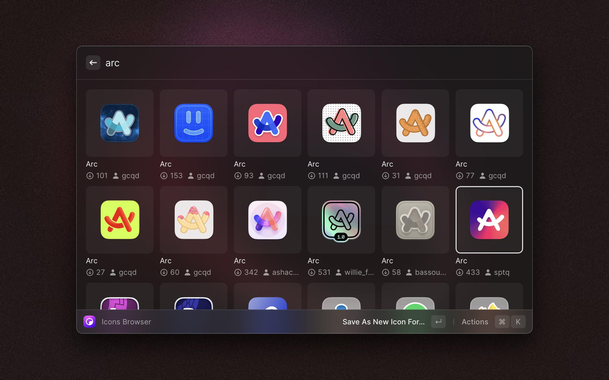

# MacOSIcons.com

Raycast extension for browsing and applying icons from [macOSicons.com](https://macosicons.com)

The process of updating an icon for you Mac apps never was so easy:

1. When you find an icon you like, select it, press `return` _(or select the default action from the menu)_
   
2. Find the application that you want to change the icon of.
   
3. And _viola,_ in this few clicks you have the new shiny icon set, isn't it cool?

To see whole your history of icon changes made since the beginning, there's a command called `Icons History`, which
basically does exactly what it entails. 

There are a lot of cool stuff you can do from here, I would definitely recommend exploring this one deeper, it might turn out to be much cooler than it looks like at first!

##### Many thanks macOSicons for having such a great product out there for free! <3

_P.S. if you have any questions, or you found my usage of any available resources wrong or possibly inappropriate,
please let me know right away!_
