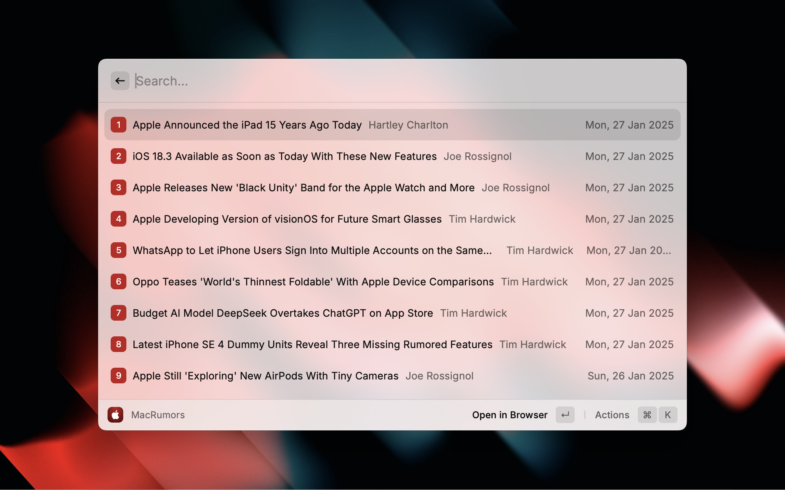

# MacRumors

Browse MacRumors headlines from the comfort of Raycast.

Inspired by the Hacker News extension and corresponding example in the Raycast developer documentation.

[Hacker News Extension](https://github.com/raycast/extensions/tree/main/extensions/hacker-news)

[Raycast Developer Documentation - Hacker News Example](https://developers.raycast.com/examples/hacker-news)

