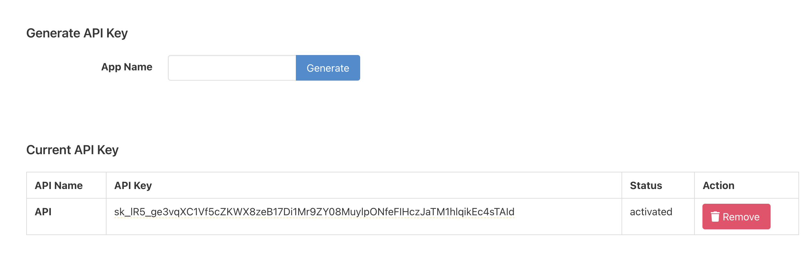
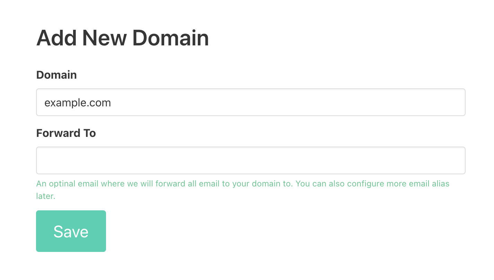
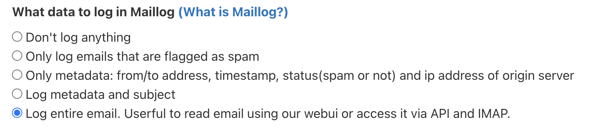

#  Mailwip Raycast Extension

This is a Raycast extension for [Mailwip](https://mailwip.com/) (previously known as **Hanami**). With this extension, you can Delete Domains, Manage Aliases, and View MailLog in Mailwip.

## 🚀 Getting Started

1. **Install extensions**: Click the `Install Extension` button in the top right of [this page](https://www.raycast.com/xmok/mailwip)

2. **Get your API Key**: The first time you use the extension, you'll need to enter your Mailwip API key:

    a. `Sign in to your Mailwip Dashboard` at [this link](https://app.mailwip.com/users/sign_in) OR `Create an account` at [this link](https://app.mailwip.com/users/sign_up)

    b. `Navigate` to [API Access](https://app.mailwip.com/api_keys)

    c. `Generate API Key` then `Copy API Key`
    

    d. Enter `API Key` in Preferences OR at first prompt

3. **Add Domains**: You will need to add each domain:

    a. `Navigate` to [+ Add domain](https://app.mailwip.com/domains/new)

    b. `Add` the domain
    

    c. `Add DNS Records` in your domain's DNS and check records through Mailwip

    d. Run `domains` command and `Add New Local Domain` for each domain

4. (OPTIONAL) **Enable Maillog**: To log emails you need to enable Maillog:

    a. `Navigate` to **Configure** in domain i.e. https://app.mailwip.com/domains/[DOMAIN_HERE]/edit

    b. `Select` your desired log level and `Save`
    

## 🔧 Commands

This extension provides the following commands:

- Aliases
    - View Aliases
    - Create Alias
    - Delete Alias
- Domains
    - View Domains
    - Delete Domains
    - Add New Local Domain
- Emails
    - View Emails in Maillogs