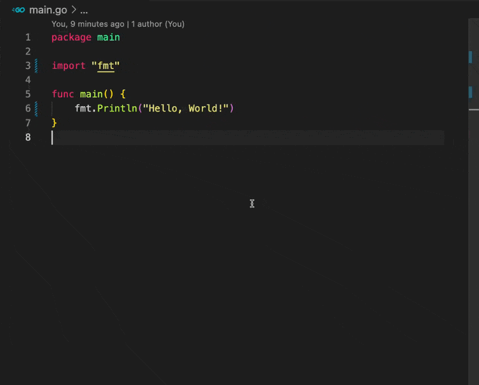

# Markdown Codeblock

Wraps your code in a Markdown code block.

This works well when chatting with AI, as it provides more context for the code block.

## Recommended Hotkey

`⌘;`

## How to Use

### Paste from Clipboard

1. copy the code you want to wrap in a codeblock and run the command
2. select the language you want to use for the codeblock and press enter (⏎)

### Paste from Selection

1. select the code you want to wrap in a codeblock and run the command
2. select the language you want to use for the codeblock and press cmd + enter (⌘⏎)



## Example

I have the following code in my clipboard:

```go
package main

import "fmt"

func main() {
    fmt.Println("Hello, World!")
}
```

I run the command and select `go` as the language for the codeblock:

and the codeblock is inserted in the markdown file:

````markdown
```go
package main

import "fmt"

func main() {
    fmt.Println("Hello, World!")
}
```
````

## Credits

Thanks for icons from [vscode-material-icon-theme](https://github.com/material-extensions/vscode-material-icon-theme)
