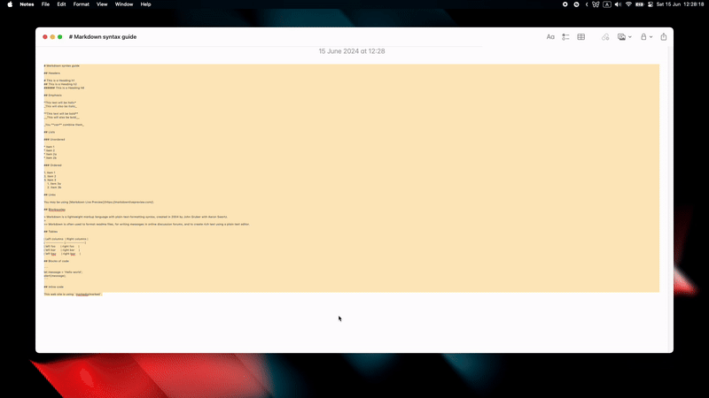
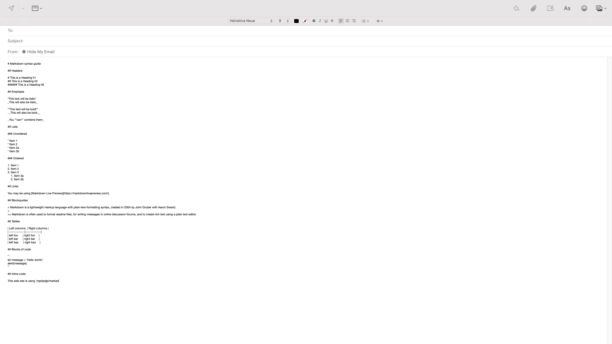
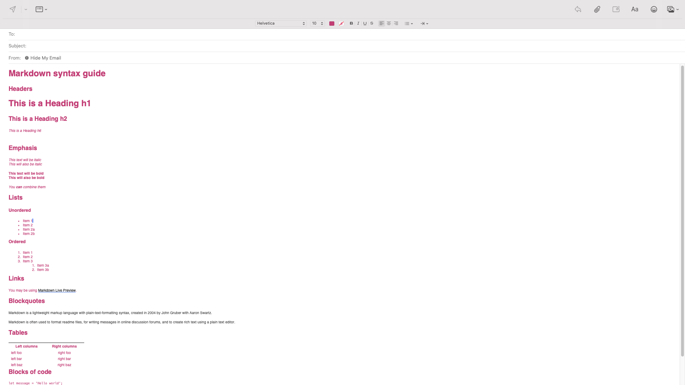

# Markdown to Rich Text Raycast Extension

## Overview

Transform Markdown into stylish RTF (Rich Text Format) with ease using this Raycast extension. Ideal for importing into rich text-compatible applications, it offers a seamless conversion experience.



## Key Features

- **One-Command Conversion**: Instantly turn Markdown into RTF.
- **Rich Styling**: Preserve formatting like bold, italics, and code blocks.
- **Font Customization**: Choose your preferred font family, size, and color.
- **Customizable CSS**: Apply customizable CSS for syntax colors.
- **Pandoc Integration**: Utilize your Pandoc path for reliable conversions.
- **User Preferences**: Tailor settings effortlessly for a personalized touch.

## Prerequisites

Pandoc is essential for this extension. Ensure it's installed on your system to facilitate Markdown-to-RTF conversion.

### Pandoc Installation

Lacking Pandoc? Fetch it from the [Pandoc Releases page](https://www.pandoc.org) or via a package manager.

**For macOS (Homebrew):**

```bash
brew install pandoc
```

### Setting Pandoc Path

Post-Pandoc installation, configure its path in Raycast:

1. Access Raycast preferences.
2. Head to "Extensions".
3. Locate "Markdown to Rich Text".
4. Input your Pandoc path in "Pandoc Path".

Adjust the default `/usr/local/bin/pandoc` as needed.
## How to Use

To quickly convert Markdown to RTF, follow these steps:

1. Highlight the Markdown text.
2. Trigger the Raycast command.
3. The RTF output will be copied to your clipboard and can be optionally pasted.

## Personalization

Tweak these settings in Raycast:

- **Font Family**: Define the converted text's font.
- **Font Size**: Set the size (10-36).
- **Text Color**: Choose a color for the text.
- **External CSS File**: Switch on for custom CSS usage.
- **CSS HTML Path**: Point to your CSS HTML file with HTML-wrapped CSS for styling.

## Support & Feedback

Encountered issues or have enhancement ideas? Share them on our [GitHub repository](https://github.com/your-username/your-repo).

## Visuals
Before and after conversion:



## License

Released under the MIT License.