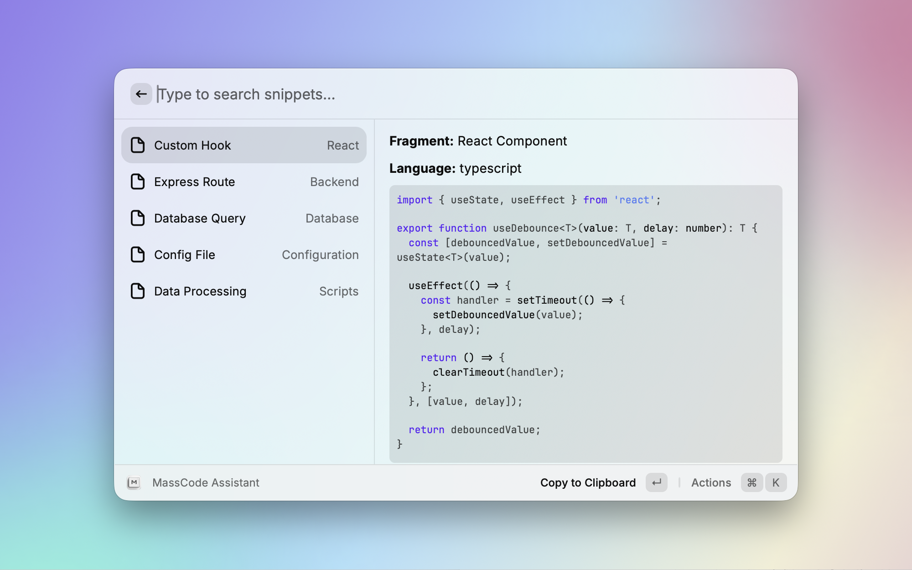

# massCode Assistant for Raycast

Fetch snippets from [massCode](https://github.com/massCodeIO/massCode), search and copy to clipboard.



## Setup

Requires massCode v6.0.1 or later.

1. In massCode, open **Preferences > API**, turn on **Enable API integrations** and click **Generate token**.
2. Copy the token and paste it into the **massCode API Token** preference when Raycast asks for it.
3. If you changed the API port in massCode, update the **massCode API Port** preference too.

## Manual install to Raycast

```bash
npm i && npm run dev
```

After executing the command, you can stop development mode. The extension will be installed.
