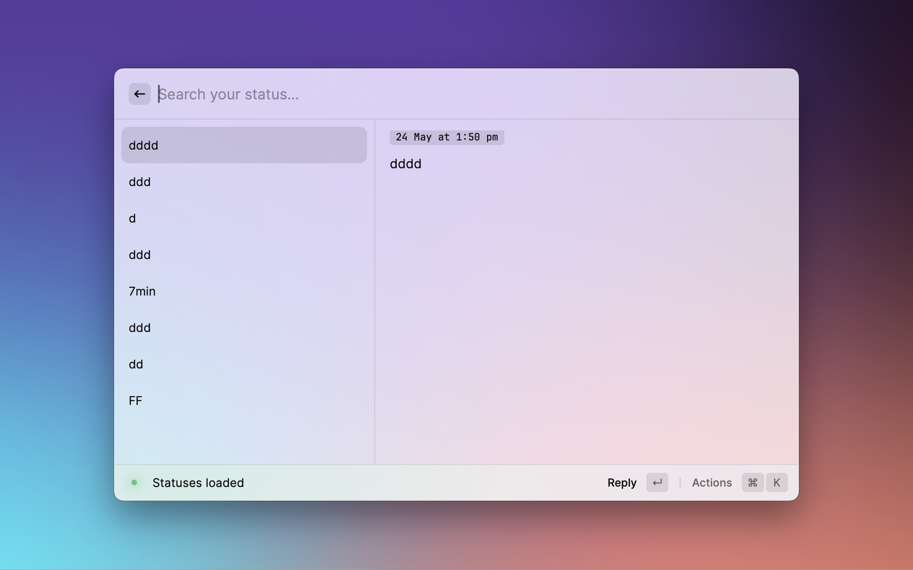

# Raycast Extension for Mastodon

-  [Mastodon](https://joinmastodon.org/) 
-  [Raycast](https://raycast.com)

The original version was based on [Raycast-Akkoma](https://www.raycast.com/SevicheCC/akkoma), thanks to the generous contributions of [BasixKOR](https://github.com/BasixKOR) and [pernielsentikaer](https://github.com/pernielsentikaer), many new features have been added.

**Features**:
- Boost / favourite / bookmark / reply / edit / delete status
- Write status with markdown support.(Only if the instant supports Markdown)
- Publish simple status with text.
- Publish scheduled status with natural date format.
- Publish status with attachments (image, video, files); add alt text to the image when only one image is attached.
- Save draft status.
- View your bookmarked statuses.
- View your latest statuses.
- View home timeline.
- Open the latest published status that was published from Raycast through the actions.

## Login

Input your Mastodon instance's URL, then click the "Continue" button in the bottom-right corner.

## Examples:

### Add simple status with text

### Add scheduled status

### Add status with image and alt text

### Mark status as sensitive 
Toggle the "Sensitive" checkbox to mark the attached image as sensitive, or add a content warning to the status.

### Write status with markdown
Toggle the "Markdown" checkbox to render markdown in the text file. Markdown shortcuts are also supported (e.g., pressing `⌘` + `B` will add `**bold**` around the selected text, `⌘` + `I` will make the selected text italic, etc.).

### View Home Timeline

### View your latest status

### Reply to Status

### Actions

### Draft status 

## Available Settings

If the instance supports Markdown, please select the `Built-in Markdown Support` checkbox. 

### Status limit
Based on performance considerations, the number of statuses displayed is limited, with the default being 20. You can adjust this limit in the extension settings.

