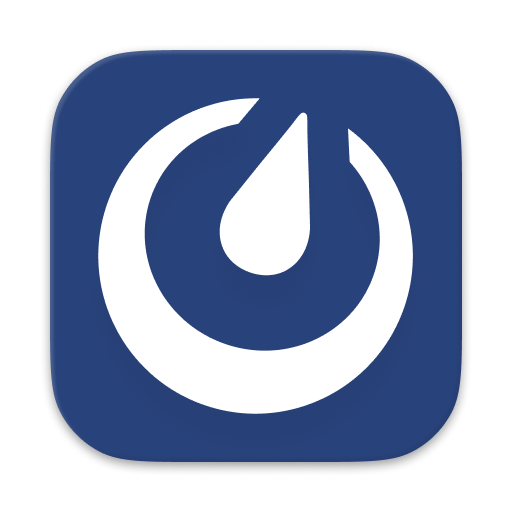

    

# Mattermost

This is an extension for [Mattermost](https://mattermost.com/).

## 🛂 Authorization

You can authorize in 2 ways:

1. By username and password
2. By personal access token

A personal access token is a more preferable and flexible method of authorization, but if the team's server settings do not allow you to create one, you can use the password authentication option.

### How to get an access token?

You can learn more about how to create your token in the official documentation:
https://developers.mattermost.com/integrate/reference/personal-access-token/

## ⚙️ Settings

1. For the initial configuration you need to specify the server URL (i.e. the workspace url of the Matermost instance).
This can be extracted from the browser address bar by opening the messenger in your browser.

2. If you are a member of several teams at the same time, you must explicitly specify the default team name in the extension settings.

3. You can choose to open deep links in browser or Mattermost application (default).

## 📜 Commands

### Search Channel

- Get all user channels by category: favorites, channels, direct messages
- Search channels by channel name or username
- Display direct chat member status
- Open chat in Mattermost app (note: require preliminary opening)

### Set Custom Status

- Get and set custom user status with emoji + title + expiration date
- Save custom status templates/presets for later reuse

### Set Presence Status

- Get and set presence status: online, away, offline, do not distrub

