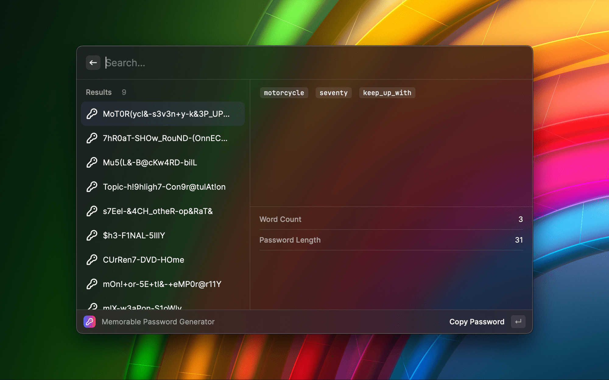

# Memorable Password Generator Extension for Raycast

Generate Password is an extension for Raycast that allows you to generate strong and memorable passwords.



During the process of designing and generating passwords, we aim to balance two main factors: memorability and robustness.

1. **Memorability**: A memorable password means that it is easy for users to remember without the need to write it down or rely on a password manager. To make passwords more memorable, we can use techniques such as using phrases or combinations of related words, such as using the Oxford 3000 word list. This approach generates passwords that are easy to remember because they are composed of actual, meaningful words.

2. **Robustness**: A robust password should be sufficiently complex to resist guessing or brute-force attacks. This typically means that passwords should be long enough and include a variety of characters, such as uppercase and lowercase letters, numbers, and symbols. For example, we can enhance password robustness by using Leetspeak rules and randomly selecting symbols.

However, memorability and robustness are often trade-offs: a highly robust password may be difficult to remember, while an easily memorable password may lack robustness. This is why it is important to find a balance between these two factors when designing a password generation strategy.

## The Oxford 3000

```
a
abandon
abandoned
……
youth
zero
zone
```

## Leetspeak

Original letter | Proximity number | Shape proximity character
---------|----------|----------
a        | 4        | @
b        | 8        |
c        |          | (
e        | 3        | &
g        | 9        | 
i        | 1        | !
l        | 1        | |
o        | 0        |
q        | 9        |
s        | 5        | $
t        | 7        | +
z        | 2        | 

## Features

- [x] Generate multiple passwords with customizable options.
- [ ] Write the generated word group into a sentence that is smooth, grammatical and meaningful.

## Installation

### Store

[Memorable Password Generator Extension for Raycast]()

### Manual

```shell
git clone https://github.com/gandli/generate-password-raycast-extension
cd generate-password-raycast-extension
npm install && npm run dev
```

## Usage

1. 🚀 Launch Raycast and open the Command Palette.
2. 🖋️ Type "Generate Password" and select the corresponding command.
3. ⚙️ Customize the password options, such as word count and password length.
4. 🔑 Press Enter to generate passwords.
5. 📋✅ Copy the generated password by clicking the copy button.

## Notes

📝🔒 Please note that the generated passwords are strong and secure, but it is always recommended to use a password manager for storing and managing passwords.

## Author

gandli

## GitHub

[GitHub Repository](https://github.com/gandli/generate-password-raycast-extension)

🐞🛠️ Feel free to contribute, report issues, or suggest improvements on GitHub.

## License

📜🔓 This extension is licensed under the [MIT License](https://opensource.org/licenses/MIT).
