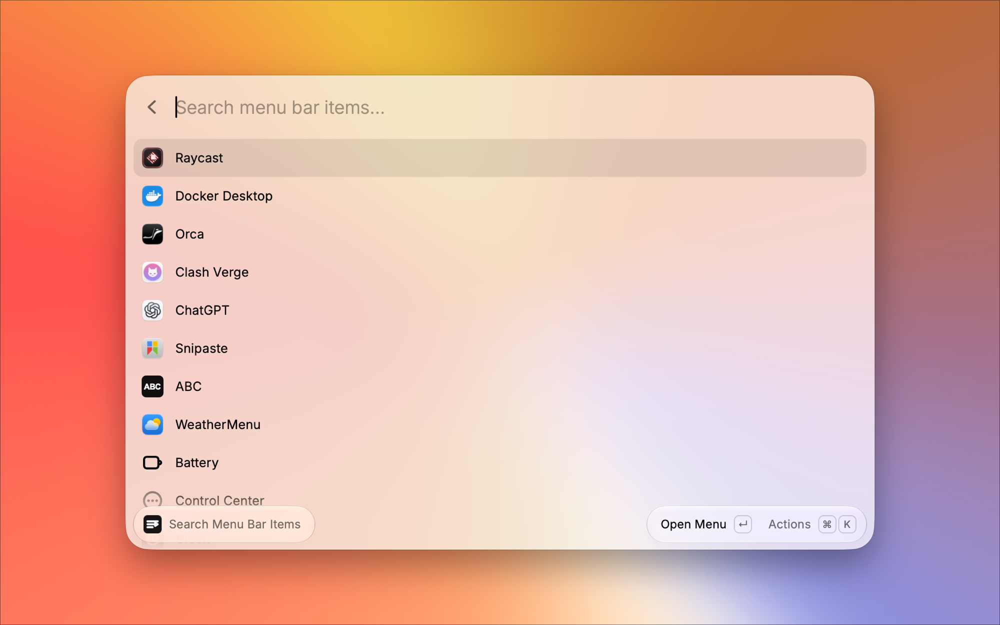
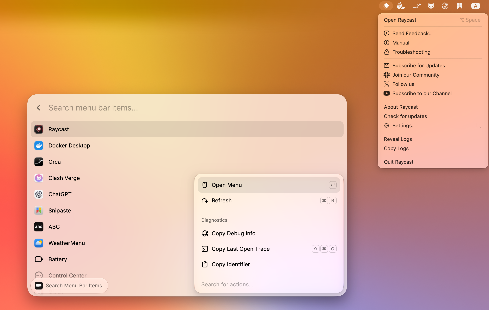

# Menu Bar Search

Search and open macOS menu bar items directly from Raycast, including icons that are hidden behind the MacBook notch and no longer clickable with the pointer.

Menu Bar Search is built for crowded menu bars. When macOS hides status items behind the camera housing, you can still find the item in Raycast and open its menu without rearranging apps, changing display settings, or guessing where the icon went.

Choosing **Open Menu** opens that item's real menu bar menu, even when its icon is hidden behind the notch:

The extension uses the public macOS Accessibility API. It only lists menu bar items that are currently exposed in the Accessibility tree, so ordinary app menus such as File, Edit, or View are not included.

## Features

- Search visible and Accessibility-exposed macOS menu bar items, system extras, input methods, and supported app status items.
- Open the selected item from Raycast, even when a menu bar icon is hidden behind the MacBook notch.
- Refresh the list when menu bar items move, appear, or disappear.
- Copy diagnostic details for troubleshooting Accessibility edge cases.

## Requirements

- macOS
- Raycast with Accessibility permission enabled

When prompted by macOS, grant Accessibility permission to Raycast. You can also open System Settings manually and enable Raycast under Privacy & Security -> Accessibility.

## Setup

1. Install dependencies with `npm install`.
2. Build the Swift helper with `npm run build-helper`.
3. Run the extension with `npm run dev`.
4. Grant Accessibility permission to Raycast when macOS asks.

## Useful Commands

- `npm run generate-icon` regenerates the PNG extension icon.
- `npm run build-helper` compiles `helper/menubarctl.swift` to `assets/menubarctl`.
- `npm run test:helper` runs helper self-tests for dynamic item matching.
- `npm run build` builds the Raycast extension and type-checks the command.
- `npm run lint` runs the Raycast Store checks.
- `npm run publish` opens a Store submission pull request.
- `./assets/menubarctl permissions` checks whether Accessibility permission is granted.

## Helper Binary

The extension includes a small Swift helper for reading and opening menu bar Accessibility elements. The helper is built from `helper/menubarctl.swift` into `assets/menubarctl` with `npm run build-helper`.

The helper does not use private macOS APIs and does not download external binaries.

## Architecture Notes

- The Swift helper owns the Menu Bar Catalog, Semantic Category, Open Policy, Open Attempt, and Debug Snapshot logic.
- The Raycast command owns product UI only; helper protocol details live behind a small helper Adapter, and Raycast-side opening fallbacks live behind a Menu Bar Opening module.
- The UI does not infer menu bar categories. It presents the category returned by the helper, which keeps list behavior, icons, and opening strategy aligned.
- Opening a stale list item re-resolves the current Accessibility element from stable owner/title/category facts before considering frame proximity.
- The command may display a cached catalog immediately for speed, but opening still uses the helper to resolve the current Accessibility tree before acting.
