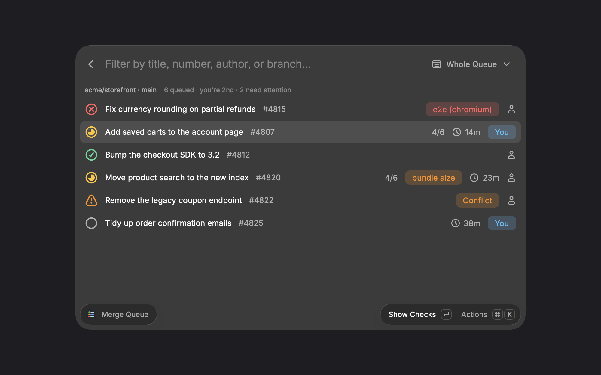
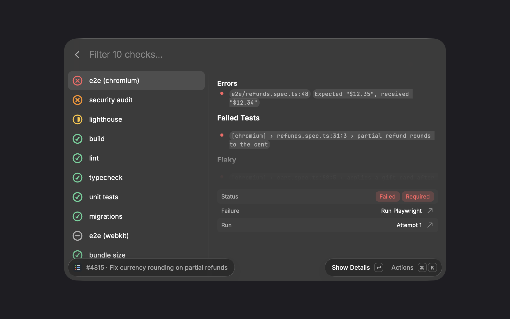

# Merge Queue

See a GitHub merge queue from Raycast: where your pull request sits, what's running, and what's failing, with drill-down into each job's steps and log.



## Commands

**Merge Queue** asks for a repository the first time, then lists every entry in the queue, in order, with its state:

- **Merging**: the entry at the front that GitHub is landing now
- **Running checks**: with how many required checks have finished
- **Checks failed**: a required check failed, named in the row
- **Merge conflict**: GitHub couldn't build a merge group, so no checks ran
- **Waiting to build** / **Ready to merge**

Optional checks that fail are shown in orange and don't count against the entry. Filter to **Mine** or **Needs Attention** from the dropdown.

`↵` on an entry opens its checks in two columns, built for debugging. The left column lists every check, failed first, then running, then finished. The right column previews the selected failure: errors with links to the file and line at the queued commit, failed and flaky tests, and the part of the log around the error. Below that, **Failure** links to the exact log line on GitHub (`⌘↵` opens it), with the run, duration and pull request. `↵` opens the full report, and `⇧⌘C` copies a summary with the link to paste into chat.

Errors come from GitHub's annotations when a tool reports them. When it doesn't, the extension finds them in the log without knowing the tool: it looks only at the failed step, scores each line for signs of failure (`error:`, `FAIL`, `panic:`, tracebacks, assertion diffs) and skips build-tool wrap-up and warnings. It then compares the log with the last passing run of the same job and sets aside every line both runs printed, so a failure with no error wording still stands out and shared output collapses to `⋯ N lines also in the last passing run`. File paths are linked only after GitHub confirms the file exists at that commit. Failed test names are read for Jest, Vitest, Playwright, pytest, Go, RSpec, Cargo, Gradle and .NET.



**Merge Queue Menu Bar** shows your position (`#3 · 14m`) with an icon for your worst entry's state, refreshing every minute. Each entry has a submenu with its failing checks and a rerun action.

## Setup

Install and sign in to the [GitHub CLI](https://cli.github.com): `brew install gh && gh auth login`. That's all; there's nothing to fill in.

If `gh` isn't installed, isn't signed in, its sign-in expired, or your organization's single sign-on hasn't authorized it, the extension says which and offers to fix it: `↵` opens Terminal with the right `gh` command, or GitHub's authorization page for single sign-on. It retries every few seconds, so it picks up as soon as you're done.

## Choosing a Repository

Most people watch one queue, so the extension remembers yours and opens straight to it. The first time, if you have a pull request queued in exactly one repository, or only one of your repositories has a merge queue, it picks that one for you. Otherwise it lists repositories to choose from:

- **Your Queued Pull Requests**: repositories where one of your pull requests is in a merge queue right now
- **Merge Queue On**: your most recently pushed repositories, and ones you've contributed to, that have a merge queue
- **Your Other Repositories**: the rest, for a queue the extension couldn't detect

To switch, use the **Repository** section of the dropdown next to the search bar (`⌘P`), which lists the current repository, recent ones and your other repositories with a merge queue, or press `⇧⌘P` for the full list. Type to search all of GitHub, sorted by recent pushes, stars, or best match. Type `owner/name` to go straight to a repository, or `owner/name:branch` for a queue on a branch the extension can't detect.

A queue is detected on the default branch, on a branch named in a ruleset with a merge queue rule, or on the base branch of your queued pull requests. **GitHub CLI Path** is found automatically in `/opt/homebrew/bin`, `/usr/local/bin` or `/usr/bin`; set it in preferences if `gh` lives somewhere else.

The extension reads through `gh`, so it sees exactly what your `gh` account can see. Each refresh is one GraphQL query. Required checks come from the branch's rulesets and branch protection (read access is enough) and are cached for an hour. Job logs are only fetched when you open a failed job, or press `⌘L` on another one. Comparing with a passing run costs one more log download and three small API calls the first time a job fails; the result is cached for six hours per workflow and job.

## Shortcuts

| Key   | Action                                                              |
| ----- | ------------------------------------------------------------------- |
| `↵`   | Show checks / show the full report for a check                      |
| `⌘↵`  | Open the failure on GitHub, at the failing log line                 |
| `⇧⌘F` | Show the entry's failing job                                        |
| `⇧⌘R` | Rerun failed jobs (asks first)                                      |
| `⇧⌘J` | Rerun this job (asks first)                                         |
| `⇧⌘C` | Copy the PR URL, or a failure summary with links to paste into chat |
| `⇧⌘E` | Copy the log excerpt                                                |
| `⇧⌘B` | Copy the branch name                                                |
| `⇧⌘G` | Open the merge queue on GitHub                                      |
| `⌘L`  | Load the log of a job that didn't fail                              |
| `⌘R`  | Refresh                                                             |
| `⇧⌘P` | Switch repository                                                   |

## Development

```bash
npm install
npm run dev    # loads it into Raycast
npm test
```

Screenshots use made-up data: `raycast://extensions/dholliday/merge-queue/merge-queue?launchContext=%7B%22demo%22%3Atrue%7D`
