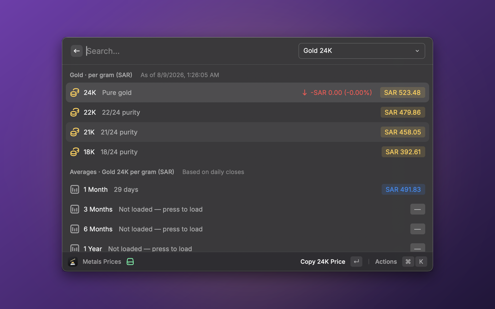
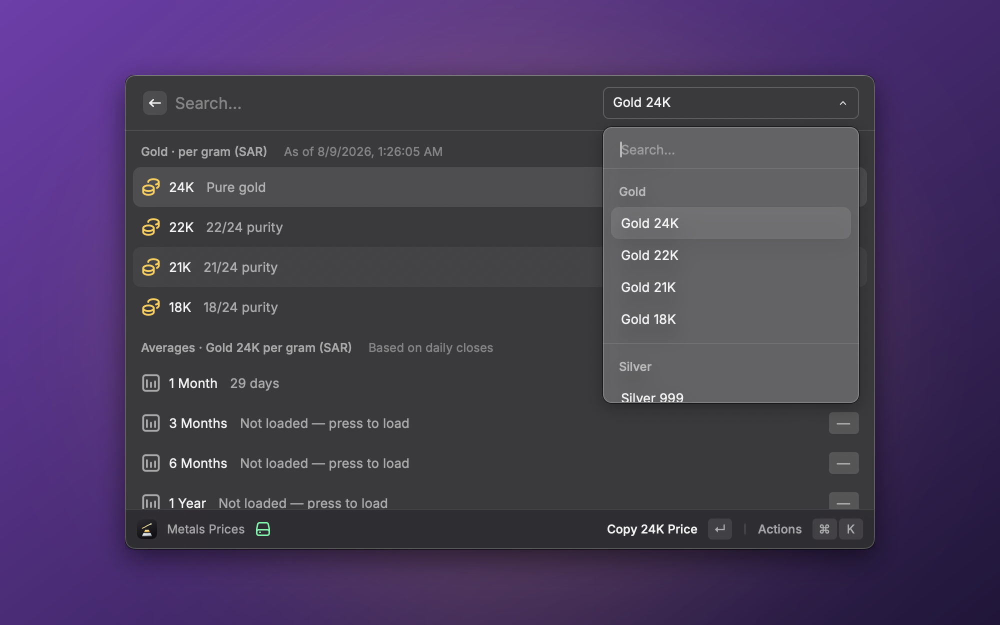
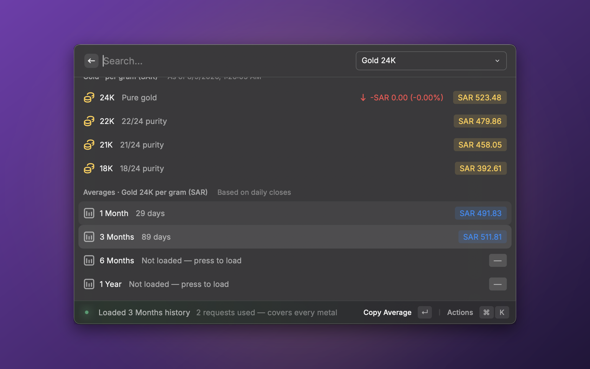

# Metals Prices

Daily **gold, silver, platinum and palladium** prices **per gram**, broken down by the purity grades each metal is actually traded in — gold in **24K / 22K / 21K / 18K**, the white metals in fineness (**999 / 958 / 925 / 900**, **950**, …) — along with **1-month, 3-month, 6-month, and 1-year averages**.

> Prices are shown in **Saudi Riyal (SAR)** by default. Pick a different **Display Currency** in the extension preferences (SAR, AED, KWD, QAR, BHD, OMR, USD, EUR, GBP).

## Screenshots

## Features

- **Four metals** — gold, silver, platinum and palladium, each with the purity grades it's sold in.
- **Live spot price** per gram for every grade of the selected metal.
- **Daily change** vs. the previous close (on the pure-metal row).
- **Period averages** (1M / 3M / 6M / 1Y) computed from real daily closes.
- **Switching metals is free** — one API request already returns every metal, so browsing between them never costs extra quota.
- **On-demand history** — opening the command loads only the recent ~30 days (so the current price and the 1-month average are ready instantly); the 3M / 6M / 1Y averages load only when you press them, and each shows exactly **how many API requests it will use** first.
- **Remembers your selection** — the metal and purity you last viewed is where the command opens next time.
- **Selectable display currency** — SAR, AED, KWD, QAR, BHD, OMR, USD, EUR, or GBP.
- **Quota-friendly caching** so it stays comfortably inside the free API tier.

## Setup

This extension uses the [metals.dev](https://metals.dev) API.

1. Create a free account at **https://metals.dev/pricing** and copy your API key (the free tier allows 100 requests/month — plenty, thanks to caching).
2. Open **Show Metals Prices**. Raycast will prompt for **metals.dev API Key** before the command runs — paste the key there. You can change it later from the Action Panel → **Open Extension Preferences**.

## How the data works

- **Current prices** come from the metals.dev `latest` endpoint, which returns **all metals in a single response**, already in the display currency per troy ounce; the extension converts them to per-gram per purity grade.
- **Averages** are computed from a daily history (the metals.dev `timeseries` endpoint, which likewise returns every metal per day), stored locally. To keep API usage low and predictable, only the recent ~30 days load automatically — enough for the 1-month average. Opening the command therefore costs just **2 requests** the first time, and usually **0** afterward (results are cached for 12 hours).
- **Longer averages load on demand.** The 3M / 6M / 1Y rows start as _"Not loaded"_ and show how many requests they need; press one to fetch and cache that window. Because a request carries every metal, loading a window for one metal loads it for all four. Once loaded, those days are immutable and never refetched.
- Prices are indicative spot values and may differ from local retail prices, which include making charges and dealer margins.

## Purity conversion

Per-gram prices are derived from the pure-metal spot price:

- 1 troy ounce = 31.1034768 grams
- `price_per_gram_pure = spot_per_troy_ounce / 31.1034768`
- `price_per_gram_grade = price_per_gram_pure × fineness`

Gold uses the karat convention (`fineness = karat / 24`, so 24K is treated as pure); silver, platinum and palladium use parts-per-thousand fineness (925 sterling = 0.925, and so on).

## Why only these four metals

metals.dev's `latest` endpoint also returns industrial metals (copper, aluminum, lead, nickel, zinc), but its `timeseries` endpoint returns only gold, silver, platinum and palladium. Industrial metals would therefore have no daily change and no period averages, and no meaningful purity grades — so this extension covers the four precious metals, for which every feature works.
