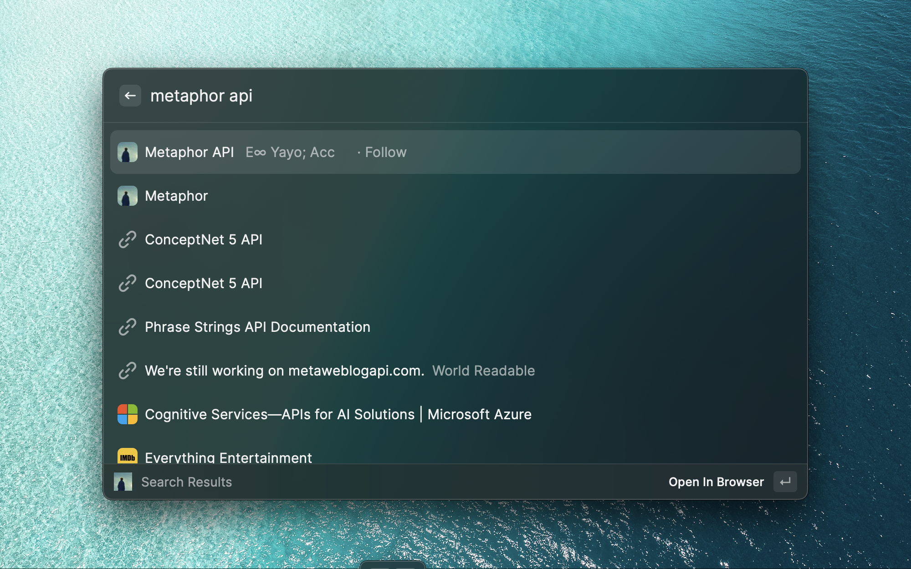
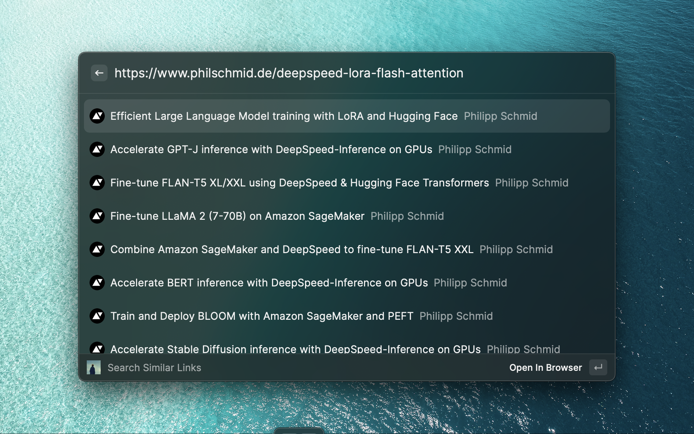

# Metaphor Extension in Raycast

**Search with Metaphor API in Raycast.**
In order to use this extension, you need to get a Metaphor API on [Metaphor's site](https://platform.metaphor.systems/).

Feel easy to contribute to this project. 

## Search your hookmarks

Open Raycast window and call "Search Metaphor".



## Search Similar

Open the Raycast window and trigger "Search Similar". Paste the URL link.



## Install Manully

```
git clone https://github.com/QIanGua/Metaphor-Search.git
cd Metaphor-Search
npm install && npm run dev
```

## TODO

- [x] Find similar link for current url