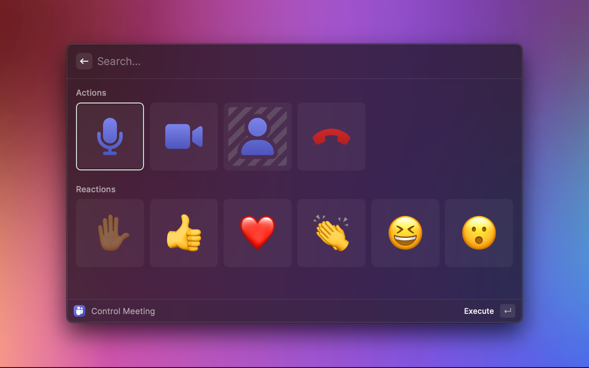

# Microsoft Teams
With this [Raycast](https://raycast.com/) extension you can control a Microsoft Teams Meeting using your keyboard – no matter whether Microsoft Teams is currently the focused app or not. You can also define global hotkeys to toggle microphone and camera. 

You can control these features during a meeting:

- Toggle microphone on/off
- Toggle camera on/off
- Toggle background blur on/off
- Leave call
- Raise hand
- Send reactions (like, love, applause, laugh, wow)

You can control all these things from one screen using the **Control Meeting** command shown in the Screenshot above. I suggest to assign a global hotkey to this screen to easely bring it up during a meeting.

## Commands and global Hotkeys
Additionally some of the actions are available as standalone commands without any UI:

- Toggle Microphone
- Toggle Camera
- Leave Call

You can use Raycast's extension settings to assign global hotkeys to your commands. This finally enables you to create a reliable global hotkey for toggling the mute state of your microphone – no matter whether Microsoft Teams is currently focused or in the background.

## Setup (API Token)
Setting up the extension is quite easy. All you need is an API token, which you will find in your Microsoft Teams desktop client:

1. Bring up the **Settings** in Microsoft Teams for desktop
2. Go to **Privacy** → **Third-party app API** and hit **Manage API**
3. Enable the **Enable API** switch
4. Copy the provided **API token** and paste it into this extension's setup screen.

> **Note**
> Microsoft started rolling out this client side API in March 2023. So if you are not seeing the **Third-party app API** section in the **Privacy** screen, you may not have been part of the gradual rollout until now und you will have to wait.
