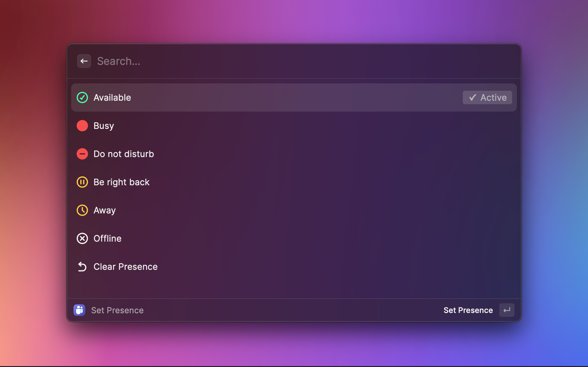
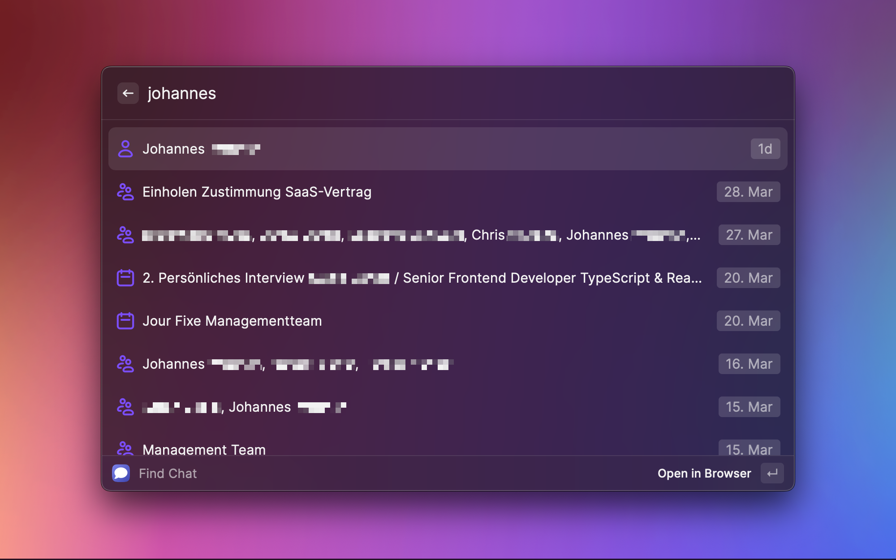

  
  <h1>
    Microsoft Teams
  </h1>
Easily manage your presence and status message with this extension. Search chats and open them or perform audio or video calls with a keystroke in the Teams app.

    
    
    
  

These features are currently available:

- Set your presence
- View presence of other users
- Set your status
- Find chats by name or member and open them in Teams
- Call a user directly with audio or video

## Setup
When starting the extension for the first time it will ask you for two IDs: The **Application ID** and the **Directory ID**. Your organization's Microsoft admin should be able to provide you these IDs after following the admin setup guide provided below. After you've entered them you'll be able to login with your Microsoft account.

## Setup for Admins
Before your users can use this extension, you as a Microsoft admin of your organization has to prepare the connection in the [Azure Portal](https://portal.azure.com/) by creating an app registration. This only has to be performed once for all users of your organization.

These are the steps:

1. Open the [Azure Portal](https://portal.azure.com/)
2. Navigate to **Azure Active Directory**
3. Navigate to **App registrations**
4. Click **+ New registration** in the toolbar
   
   1. Give the application a **Name** – "Raycast" may be a good choice here
   2. Choose the right option for the **Supported account types** – **Accounts in this organizational directory only** may be the right choice for most organizations.
   3. For the **Redirect URI** choose **Public client/native (mobile & desktop)** and use the redirect URI `https://raycast.com/redirect?packageName=Extension`
   4. Click **Register**
5. In the newly created app registration, navigate to **API permissions**:
   
   1. Click **+ Add a permission**, select **Microsoft Graph** → **Delegated permissions**, search for "presence", check `Presence.ReadWrite` and click **Add permissions**.
   2. Repeat the same steps to get this list of permissions:
      - `Channel.ReadBasic.All`
      - `Chat.Read`
      - `offline_access`
      - `Presence.ReadWrite`
      - `User.Read.All`
      - `Presence.Read.All` - needed for getting the presence of other users
   3. Click the button **Grant admin consent for undefined** to give these permissions to your users in the name of your organization. 
   
      There's nothing to fear here: Even with these permissions, your users will only be able to access things they are allowed to see.
4. That's it! Now navigate to the **Overview** of your app registration and note down the **Application (client) ID** and the **Directory (tenant) ID**. Your users require these two IDs to connect their Raycast with Microsoft Teams.
   

   **Relax:** These two IDs are no secrets and don't provide any access at all when used alone. Each user still additionally needs to authenticate using his/her Microsoft Account. You can easily provide these IDs in your internal documentation.