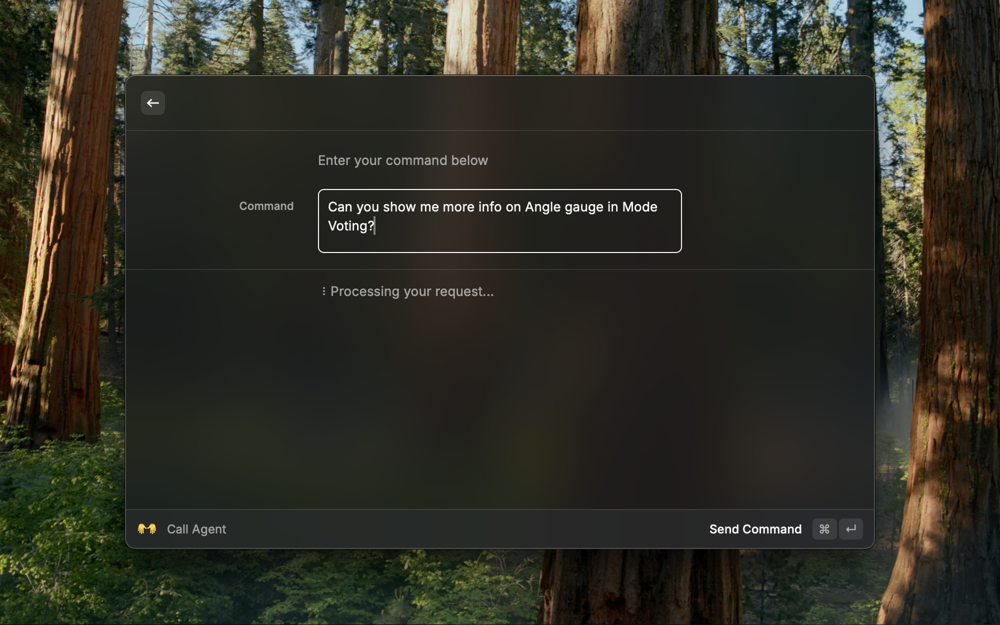

<h1 align="center">Midas</h1>

<h3 align="center">
Your AI-powered on-chain trading and governance assistant, right from your command bar.
</h3>

# Features

### Natural Language Trading

Execute on-chain trades using simple, natural language commands. Just tell Midas what you want to do, and it handles the complexity of blockchain interactions for you.

### Instant Transaction Execution

Midas will execute transactions instantly without any confirmation prompts.

### Smart Governance Participation

Participate in on-chain governance with AI-assisted voting. Midas helps you understand proposals and execute votes based on your preferences.

### Secure Transaction Management

Transactions are executed securely using your private key, which is stored locally and never shared with external services, or you can use the smart wallet which is secured by Crossmint.

### Multi-Chain Support

Midas currently supports Mode, Mantle and Base with more chains coming soon.

# How to Use

This extension supports two types of calls - one with smart wallets created in Midas' Web App and other with your private key. To get started:

1. Visit the Midas web app, go to the Config section and get your authentication code
2. Add your authentication code in the extension preferences
3. (Optional) Add your wallet private key if you want to execute transactions using your private key
4. Start using natural language commands to manage your on-chain activities

# Commands

### Call Agent

Use this command to interact with Midas using your smart wallet. Simply type your request, and Midas will understand and execute the appropriate on-chain actions.

### Call Agent (with Private Key)

Similar to the basic command, but uses your stored private key to execute transactions directly.

# Preferences

All preferences can be customized through `Raycast Settings > Extensions > Midas`

| Properties   | Label               | Type       | Required | Default | Description                                        |
| ------------ | ------------------- | ---------- | -------- | ------- | -------------------------------------------------- |
| `authCode`   | Authentication Code | `password` | Yes      | `empty` | Your unique authentication code from Midas web app |
| `privateKey` | Wallet Private Key  | `password` | No       | `empty` | Your wallet private key for executing transactions |

> **Security Note:** Your private key is stored securely and locally using the [Raycast Preferences API](https://developers.raycast.com/api-reference/preferences). It is never transmitted to external servers.

# Examples

[Check the docs here](https://midas-docs.notion.site/Midas-Docs-18d35f5d19ca80a1b6cafa8de8572ee2)

# Author

Created by [sunosuporno](https://github.com/sunosuporno)
