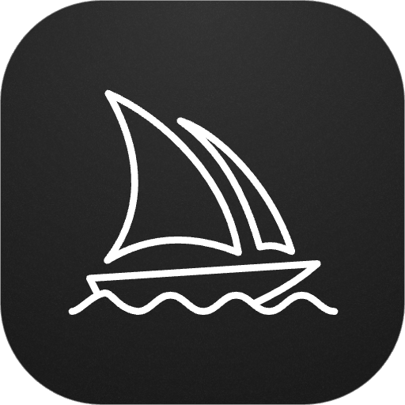

<h1 align="center">MidJourney</h1>

<h3 align="center">
Interact with Midjourney from your command bar (requires Discord server with the Midjourney bot)
</h3>

# Features

### View your creations

View and search all previous images you have created with this extension.

### Generate new images

Quickly generate new Midjourney images from your command bar.

### Alter images

Upscale, remix, and zoom your images.

### Export creations

Save your created images to your computer or copy them to your clipboard.

# How to use

This extension requires you to have a Discord server with the Midjourney bot installed in a dedicated channel.
Once you have this setup, you'll need to add your personal Discord auth token, server id, and channel id in the extension settings.

- [How to find your Discord user token](https://discordhelp.net/discord-token)
- [How to get your Discord channel/user id](https://support.discord.com/hc/en-us/articles/206346498-Where-can-I-find-my-User-Server-Message-ID-)

> **Note:** This extension is not compliant with the Terms of Service of Discord due to using a user token. Use at your own risk.

> All the preferences value will be stored locally using the [Raycast Preferences API](https://developers.raycast.com/api-reference/preferences)

# Preferences

All preferences properties list that can be customized through `Raycast Settings > Extensions > Midjourney`

| Properties     | Label         | Value    | Required | Default | Description                                                              |
| -------------- | ------------- | -------- | -------- | ------- | ------------------------------------------------------------------------ |
| `sessionToken` | Session token | `string` | `true`   | `empty` | Your personal Discord token                                              |
| `serverId`     | Server ID     | `string` | `true`   | `empty` | Your Discord server id                                                   |
| `channelId`    | Channel ID    | `string` | `true`   | `empty` | The channel id of the channel on your server that has the Midjourney bot |

# Author

Created by [Carter McAlister](https://github.com/cartermcalister)
