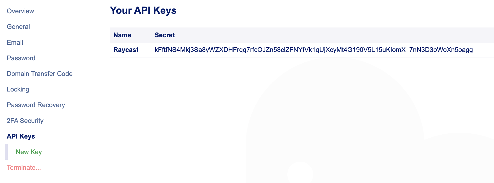
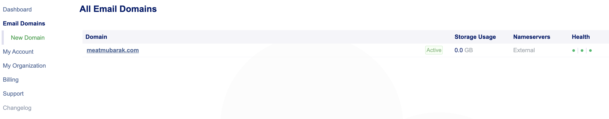
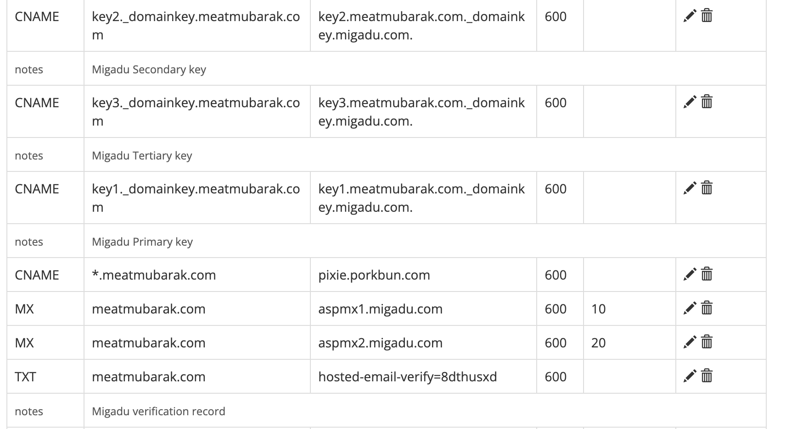

    

# Migadu Raycast Extension

This is a Raycast extension for [Migadu](https://migadu.com/). With this extension, you can View, Create, Update or Delete - Mailboxes, Identities, Aliases, Rewrites in your Migadu account.

## 🚀 Getting Started

1. **Install extension**: Click the `Install Extension` button in the top right of [this page](https://www.raycast.com/xmok/migadu)

2. **Get your API Key**: The first time you use the extension, you'll need to enter your Migadu API key:

    a. `Sign in` to your Migadu Account at [this link](https://admin.migadu.com/public/login)

    b. `Navigate` to [API Keys](https://admin.migadu.com/account/api/keys)

    c. `Create API Key` and `copy` the secret
    

    d. Enter `API Key` and `Username` in Preferences OR at first prompt

3. **Add Domains**: You will need to add each domain:

    a. `Navigate` to [Email Domains](https://admin.migadu.com/domains)

    b. `Add` the domain
    

    c. `Add DNS Records` in your domain's DNS (or set Nameservers as Migadu Nameservers)
    

    d. Enter `domain(s)` in Preferences OR at first prompt

## 🔧 Commands

This extension provides the following commands:

- Mailboxes & Identities
    - View Mailboxes
    - Create Mailbox
    - Update Mailbox
    - Delete Mailbox
    - Mailbox Identities
        - View Mailbox Identities
        - Create Mailbox Identity
        - Update Mailbox Identity
        - Delete Mailbox Identity
- Create Anonymous Identity (allows quick identity generation, can be used like Apple's "Hide My Email")
- Aliases
    - View Aliases
    - Create Alias
    - Update Alias
    - Delete Alias
- Rewrites
    - View Rewrites
    - Create Rewrite
    - Update Rewrite
    - Delete Rewrite