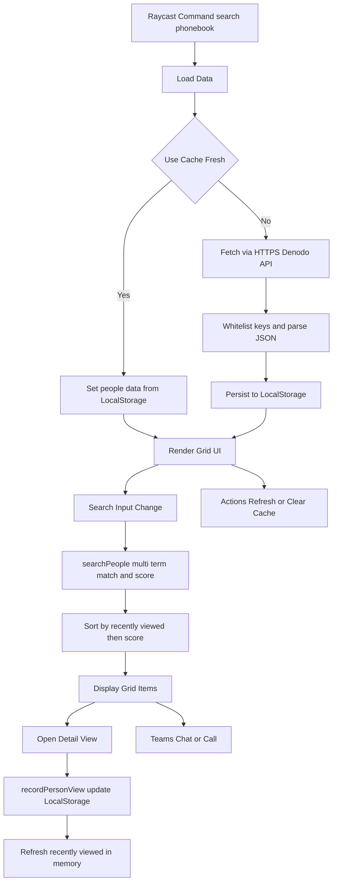

# MII Phonebook Raycast Extension — Technical Overview

This codebase is a Raycast extension that enables fast, offline-friendly searching of MITRE MII employee directory data, with rich details, Teams integration, and local caching for performance.

## Purpose and Capabilities

- Searches employee records by multiple fields with relevance scoring
- Displays a grid of people with badge photos and quick actions
- Shows detailed information including department, site, room, mailstop, phones, level, and total time at MITRE
- Integrates with Microsoft Teams for chat or call
- Caches data locally for 24 hours and supports manual refresh and cache clearing

Key files:

- [README.md](README.md)
- [package.json](package.json)
- [src/search-phonebook.tsx](src/search-phonebook.tsx)

## Command Registration and Build

- Raycast command defined in [package.json](package.json):
  - Commands array entry for the UI command named Search Phonebook
  - Preferences array for configuring user behavior, such as `resetOnTeamsAction`
- Scripts for development and build in [package.json](package.json):
  - ray develop, ray build, ray lint, publish via @raycast/api
- Development instructions and features documented in [README.md](README.md)

## Core Modules and Constructs

Configuration and constants:

- [const DENODO_BASE_URL](src/search-phonebook.tsx:17)
- [const PHONEBOOK_URL](src/search-phonebook.tsx:18)
- [const BADGE_PHOTO_URL](src/search-phonebook.tsx:19)
- [const LIMIT_RESULTS](src/search-phonebook.tsx:20)
- [const CACHE_KEY_DATA](src/search-phonebook.tsx:23)
- [const CACHE_KEY_TIMESTAMP](src/search-phonebook.tsx:24)
- [const CACHE_MAX_AGE](src/search-phonebook.tsx:25)
- [const RECENTLY_VIEWED_KEY](src/search-phonebook.tsx:28)
- [const httpsAgent](src/search-phonebook.tsx:33)
- [const LEVEL_MAPPING](src/search-phonebook.tsx:39)
- [const VALID_KEYS](src/search-phonebook.tsx:58)
- [const SEARCH_KEYS](src/search-phonebook.tsx:76)

Data URL construction and fetching:

- [function buildApiUrl()](src/search-phonebook.tsx:112) builds the Denodo API URL with selected fields and filters
- [function fetchPeopleData()](src/search-phonebook.tsx:119) performs an HTTPS GET with a custom agent allowing self-signed certs, parses JSON, whitelists keys, and returns Person[]

Search and ranking:

- [function searchPeople()](src/search-phonebook.tsx:163) splits search text into lowercased terms, requires all terms to match across SEARCH_KEYS, tallies matches per term to compute_score, and sorts by score

Utilities:

- [function formatBusinessTitle()](src/search-phonebook.tsx:203) cleans business title display
- [function getBadgePhotoUrl()](src/search-phonebook.tsx:209) constructs badge photo URL
- [function getPhonebookUrl()](src/search-phonebook.tsx:215) constructs info.mitre.org phonebook page URL
- [function getLevelDisplay()](src/search-phonebook.tsx:221) maps job levels to compact labels
- [function formatRelativeTime()](src/search-phonebook.tsx:228) formats cache age and viewed timestamps

Caching and recently viewed:

- [async function clearAllCache()](src/search-phonebook.tsx:243) confirms and clears LocalStorage items for data and timestamp
- [async function recordPersonView()](src/search-phonebook.tsx:276) updates a LocalStorage map of person id to last viewed time
- [async function getRecentlyViewed()](src/search-phonebook.tsx:288) reads and parses the map for sorting preferences

Main command UI:

- [export default function SearchPhonebook()](src/search-phonebook.tsx:298) orchestrates initial data load, cache usage, manual refresh, error handling, and renders a Grid UI with actions
- [function PersonGridItem()](src/search-phonebook.tsx:512) renders each card with badge photo, title, org, and quick actions
- [function PersonDetailView()](src/search-phonebook.tsx:603) renders a detailed view with metadata, photo, Teams links, and copy-to-clipboard actions, recording views to influence sorting

## Data Flow Overview

- On extension load, [export default function SearchPhonebook()](src/search-phonebook.tsx:298) calls loadData to either use fresh cached data or fetch new data via [fetchPeopleData()](src/search-phonebook.tsx:119)
- Successful fetch stores Person[] and a timestamp in LocalStorage for 24h reuse
- If fetch fails and cache exists, the extension shows toast and falls back to cached data
- Grid search input triggers [searchPeople()](src/search-phonebook.tsx:163), which requires all terms to be present across searchable fields and ranks by aggregate matches
- Recently viewed tracking via [recordPersonView()](src/search-phonebook.tsx:276) and [getRecentlyViewed()](src/search-phonebook.tsx:288) influences sort order to surface most recently viewed first
- Badge photos are referenced via [getBadgePhotoUrl()](src/search-phonebook.tsx:209) and loaded by Raycast; phonebook web pages opened via [getPhonebookUrl()](src/search-phonebook.tsx:215)

## UI Behavior

- Grid with 5 columns shows people cards with badge photo as content
- Primary actions: View Details, Open in Phonebook, Copy Email; plus actions to copy phone, mobile, employee number; Teams Chat and Call if email exists
- Empty states for loading, no data, no search text, and no results
- Detail view presents a markdown table with name, title, email, conditional phone rows, Teams links, and optional MII CLI link, plus metadata with level, time at MITRE, department, site, room, mailstop and navigation link to phonebook page

## Caching Strategy and Offline Behavior

- LocalStorage keys: [CACHE_KEY_DATA](src/search-phonebook.tsx:23) and [CACHE_KEY_TIMESTAMP](src/search-phonebook.tsx:24)
- Freshness threshold: [CACHE_MAX_AGE](src/search-phonebook.tsx:25) 24 hours
- Manual refresh action triggers revalidation and fetch
- Cache read errors are handled by clearing corrupted entries; cache write failures are logged and non-fatal
- If offline or fetch fails, extension falls back to stale cached data when available

## Error Handling and User Feedback

- Network or parse errors produce toasts with truncated messages and a failure empty state
- Clear cache action shows success or failure toasts

## Teams Integration

- Chat and Call URIs use user email address
- Available in both grid item actions and detail view actions
- Supports a `resetOnTeamsAction` preference to automatically return to the Raycast root view `popToRoot()` when the user initiates a chat or call

## Historical List-Based Variants

- Earlier local backup files explored a List UI instead of Grid, plus optional gravatar and badge-photo caching to disk under Raycast supportPath
- Those backup files are no longer part of the repository source; the published command is the Grid-based [src/search-phonebook.tsx](src/search-phonebook.tsx)

## Dependencies

Defined in [package.json](package.json):

- @raycast/api for Raycast components and APIs
- Typescript, ESLint, Prettier, @types

## Architecture Diagram

## Security and Network Considerations

- HTTPS agent allows self-signed certs to enable internal MITRE endpoints
- Requires MITRE network or VPN to access Denodo and static servers
- Only whitelisted fields are retained from API responses for privacy

## Potential Enhancements

- Environment configuration file for URLs and limits, with per environment overrides
- Optional fuzzy search, partial term matching, or highlighting matched terms in UI
- Additional sort options or filters by site or organization
- Resilient photo loading with local cache fallback
- Incremental updates to cache to reduce payload size
- Metrics logging of refresh and fetch failures for diagnostics
- Unit tests for searchPeople and data transformation

## Summary

The extension provides a fast, convenient interface to MITREs phonebook, combining cached data, simple relevance scoring, rich metadata, and integrated communications. Its architecture is intentionally minimal, relying on Raycast components and LocalStorage for responsive search and display within corporate network constraints.
