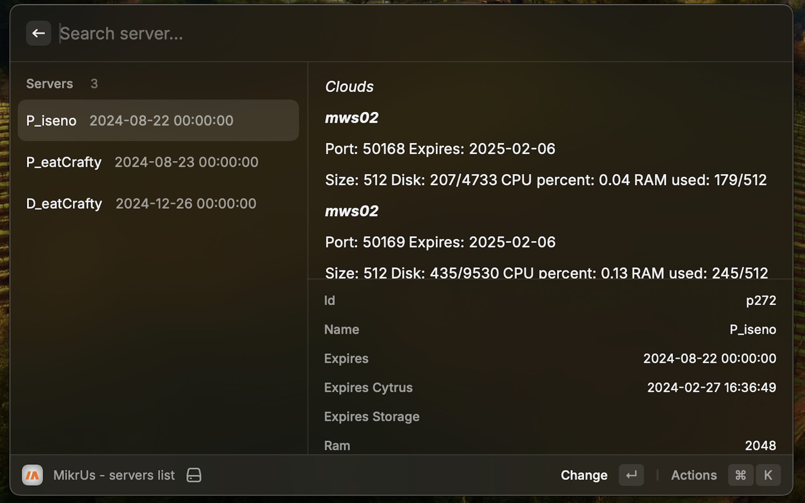

Made with ♥ from Poland

---

<h1 align="center">Mikr.us</h1>

<h3 align="center">
manage mikr.us server
</h3>

# Features
1. ability to preview the server list
2. possibility of setting separate keys for each server
3. possibility of restarting the server
4. possibility of "drugging" the server with amphetamine

# How to use

1. add your main server and token in settings
2. for each server that has been included in the list, you can add a new token

# Preferences

All preferences properties list that can be customize through `Raycast Settings > Extensions > Mikr.Us`

| Properties                   | Label                          | Value       | Required | Default    | Description                                                                                          |
| ---------------------------- | ------------------------------ | ----------- | -------- | ---------- | ---------------------------------------------------------------------------------------------------- |
| `apiKey`                     | API Key                        | `string`    | `false`  | `empty`    | Your default api key to get lists servers                                                            |
| `defaultServer`              | Default Server ID              | `string`    | `false`  | `empty`    | Your defalt id server                                                                                |

---

Made with ♥ from Poland

