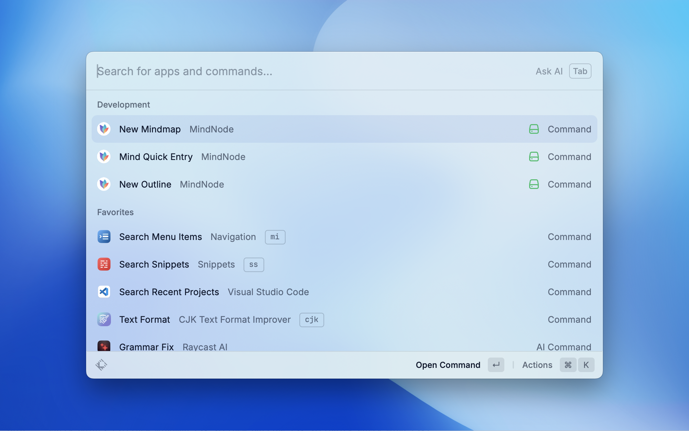

# MindNode Extension

---

Every great idea starts with a single thought. And another. And a million more. Whether you’re sipping coffee or lying on a beach — [MindNode](https://apps.apple.com/us/app/mindnode-mind-map-outline/id1289197285?l=en-US&mt=12) helps you capture those ideas and turn them into a clear visual.

## Screenshot

## Commands

---

### New Mindmap

Create a new mindmap in the default storage location.

### New Outline

Create a new outline in the default storage location.

### Mind Quick Entry

Launches Quick Entry and adds the provided text as the content.

- In order to use Quick Entry, you'll need to get MindNode Plus first.
