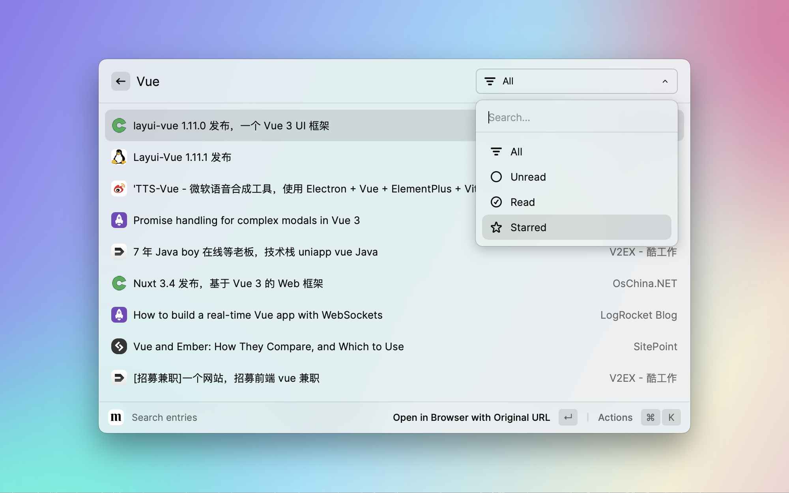
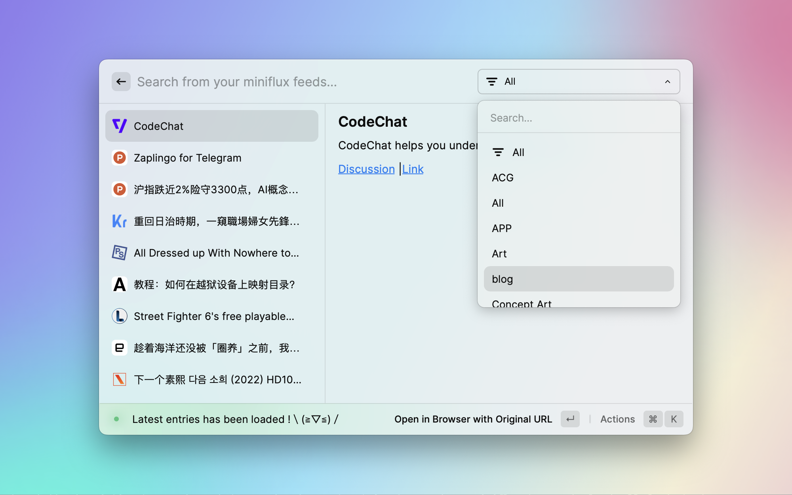
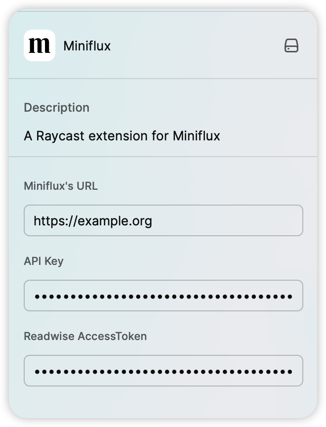

## Raycast Extension for Miniflux 

- [Miniflux](https://miniflux.app/)
- [Raycast](https://raycast.com)

**Features**
- Search entries in your subscribed RSS feeds
- Subscribe to a new RSS feed
- Read the recent entries from your subscribed RSS feeds 
- Quickly open Miniflux from Raycast
- Refresh all RSS feeds
- Save entries to [Readwise Reader](https://read.readwise.io/)
- Fetch original entry content and mark as read
- Star or unstar entries

## Examples
### Search RSS Feeds 

Filter search results by entry status 

### Read Recent RSS Feed Entries 
 
Filter entries by categories  

### Fetch Original Entry Content 
 

### Save to Readwise Reader

Before saving to Readwise Reader, you need to generate a token at [https://readwise.io/access_token](https://readwise.io/access_token>), then enter it in the extension settings: 

### Subscribe to an RSS Feed 
Discover Feeds by URL 

 

Choose an RSS Feed to Subscribe to 

 
Add Advanced Settings 

## Available Settings

### Toggle Background Refresh  

 

### Limits 

For performance reasons, the number of entries displayed is limited. The default search limit is 10, and the default feed limit is 30. You can adjust these limits in the extension settings.  

 

