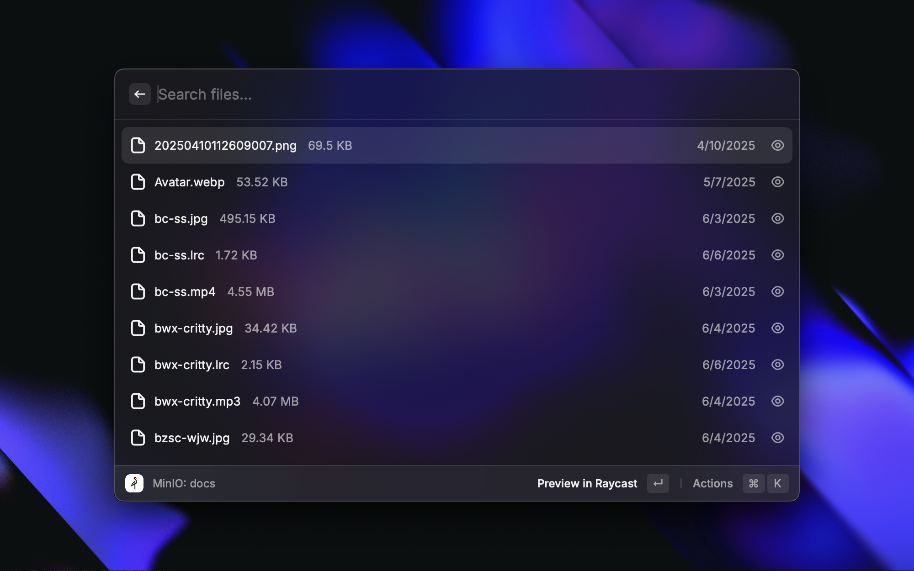
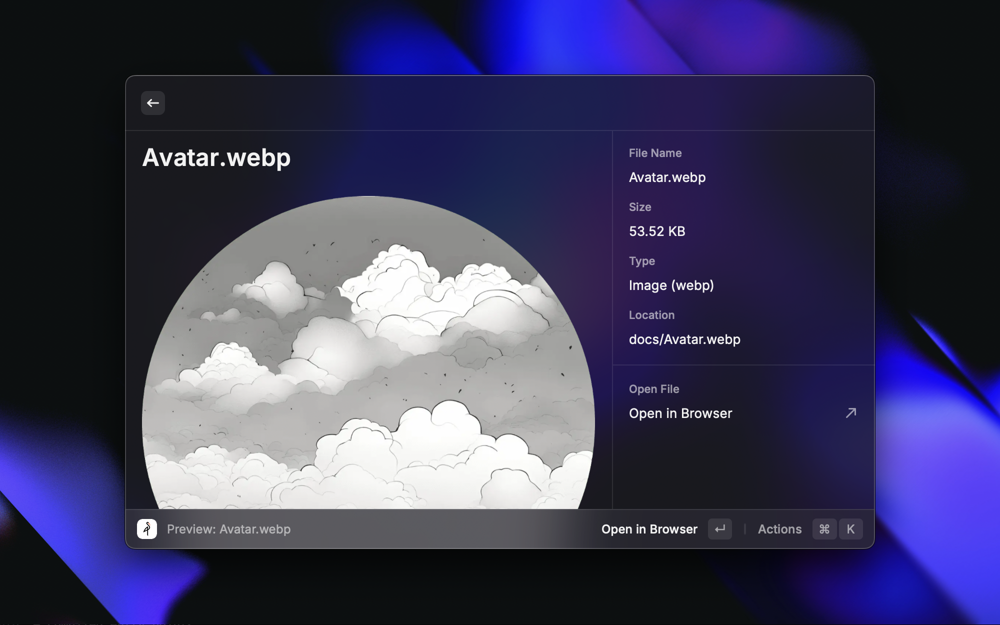

# MinIO Manager

A Raycast extension for managing files in MinIO object storage service.

## Features

- Upload files to MinIO server
- Browse and manage files in MinIO
- Select files directly from Finder
- Generate public URLs for uploaded files
- Generate temporary pre-signed URLs with 1-hour validity
- Automatically copy file URLs to clipboard after upload (optional)

## Configuration

The extension requires the following configuration:

- **MinIO Endpoint**: The MinIO server endpoint URL without protocol (e.g. play.min.io)
- **Port**: The MinIO server port (default: 443 for HTTPS, 80 for HTTP)
- **Access Key**: MinIO access key ID
- **Secret Key**: MinIO secret access key
- **Use SSL**: Enable SSL/TLS for secure connection
- **Default Bucket**: Default bucket to use for uploads
- **Public URL Base**: Base URL for generating public links to uploaded files
- **Auto Copy URL**: Automatically copy the file URL to clipboard after successful upload

## Usage

### Upload File

1. Select "Upload File" command
2. Choose a file to upload
3. Optionally specify a bucket and prefix (folder)
4. Click "Upload File"
5. After successful upload, the file URL will be displayed and optionally copied to clipboard

### List Files

1. Select "List Files" command
2. Browse through buckets and files
3. Use actions to view, generate temporary links, or delete files

### Generate Temporary Links

1. In the "List Files" view, select a file
2. Choose "Generate Temporary Link and Open" action
3. Confirm the operation
4. A pre-signed URL with 1-hour validity will be generated and opened in your browser
5. This temporary link provides secure, time-limited access to the file without making it publicly accessible

## Limitations

- Maximum file size for upload is 1 GB
- For larger files, consider using the MinIO client directly

## Troubleshooting

- If you encounter "Invalid endPoint" errors, make sure your endpoint URL doesn't include http:// or https:// prefix
- For SSL/TLS connection issues, try toggling the SSL option in the extension preferences
- Check file permissions if you're having trouble uploading files

## Screenshots




## Development

```bash
# Install dependencies
npm install

# Run in development mode
npm run dev

# Build the extension
npm run build

# Lint the extension
npm run lint
```

## Requirements

- MinIO server (self-hosted or cloud service)
- Valid MinIO credentials (access key and secret key)