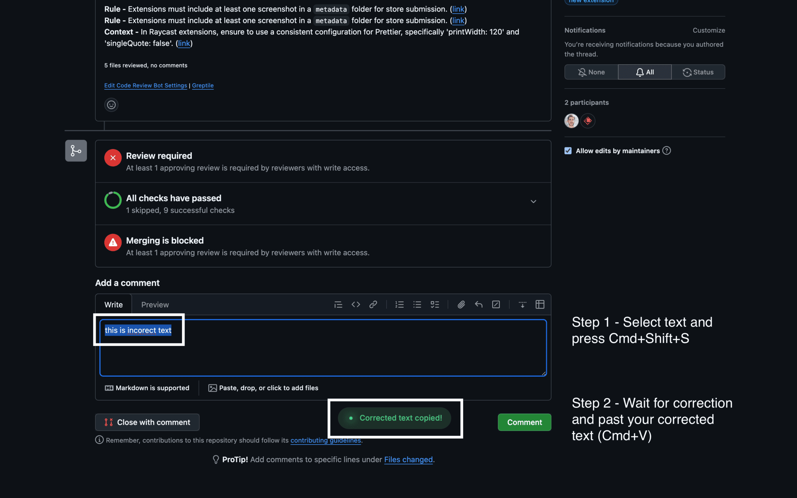

# Mistral Spell Checker

Mistral Spell Checker is a Raycast extension that provides AI-powered spell checking and grammar correction using Mistral AI's API. It follows the no-view command pattern, allowing you to quickly correct spelling and grammar without leaving your current workflow.

## Features

- AI-powered spell checking and grammar correction
- Configurable Mistral AI model selection
- Customizable API endpoint
- Seamless integration with Raycast's no-view command pattern

## Configuration

The extension provides several configurable options in the command preferences:

- **API Key** (required): Your Mistral AI API key
- **AI Model** (default: mistral-medium-latest-flash): The AI model to use for spell checking
- **API Endpoint** (default: https://api.mistral.ai/v1/chat/completions): The API endpoint to use

## Usage

1. Select the text you want to check and correct
2. Open Raycast and run the Mistral Spell Checker command
3. The corrected text will be automatically copied to your clipboard

## Requirements

- A Mistral AI API key (available from the Mistral AI platform)
- Raycast application installed on your Mac