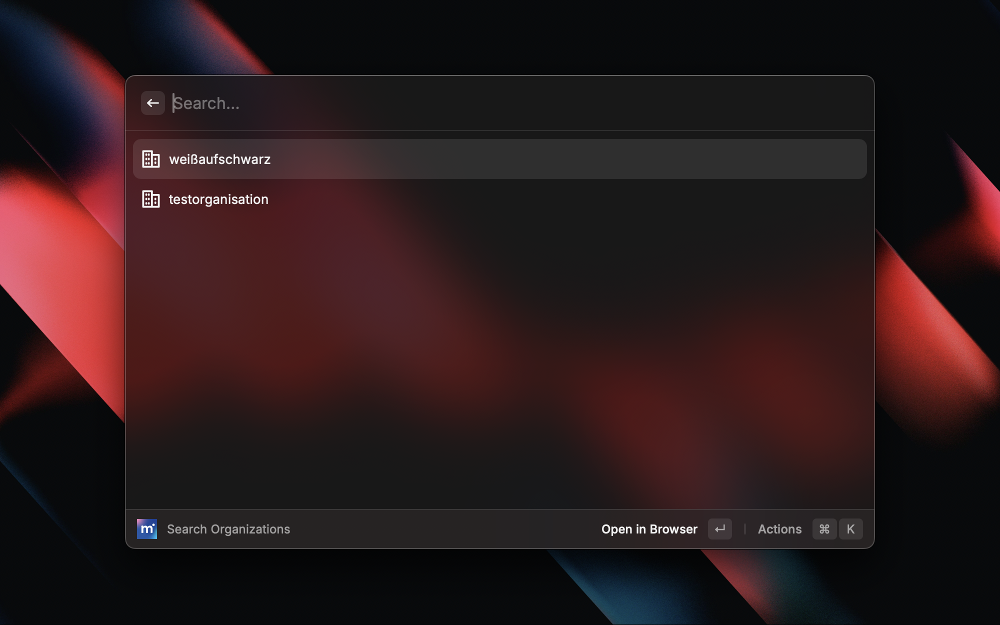
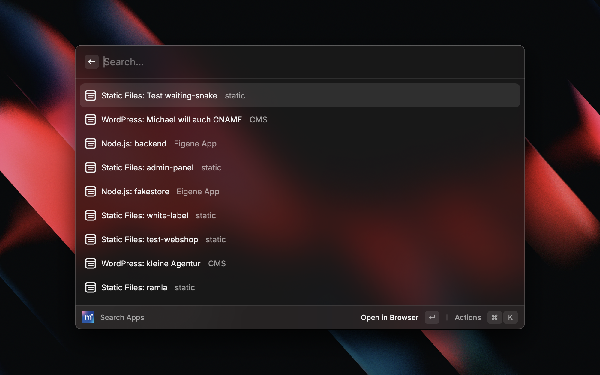
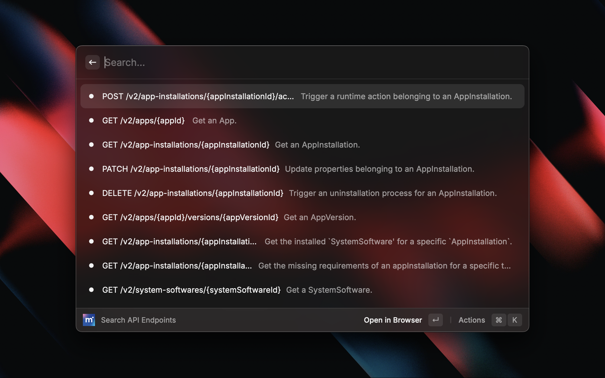

# mittwald

Search mittwald mStudio and API documentation.

## Features

- Search projects
- Search domains
- Search organizations
- Search apps
- Search API endpoints

## How to get the mittwald API token

Learn [here](https://developer.mittwald.de/de/docs/v2/api/intro/#ein-api-token-beziehen) how to generate a mittwald API token. As of now a token with **write access** is required (mittwald is currently fixing this).

## Showcase

### Search Projects

### Search Domains

### Search Organizations

### Search Apps

### Search API Endpoints

