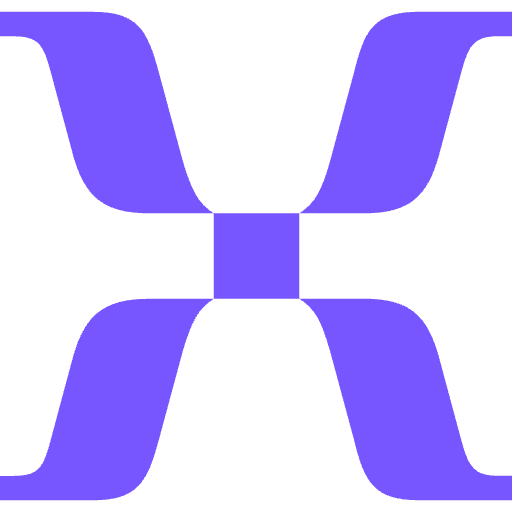

    

# Mixpanel

This extension lets you find a user from your Mixpanel Dashboard.

## 🔑 To authenticate, you need:

- your project id
- a service account with its secret ([Service Accounts](https://developer.mixpanel.com/reference/service-accounts))

