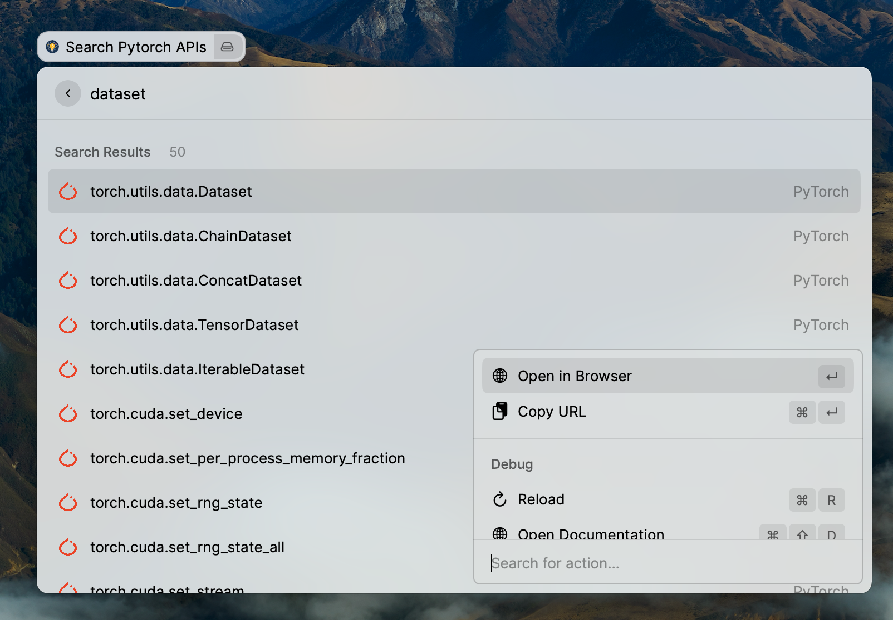

# MLDocs Extension for Raycast

This extension allows you to search for common machine learning APIs:

- [Pytorch](https://pytorch.org/docs/)
- [Tensorflow](https://www.tensorflow.org/api_docs/python?hl=en)
- [Scikit-Learn](https://scikit-learn.org/stable/modules/classes.html)
- [Pandas](https://pandas.pydata.org/pandas-docs/stable/reference/index.html)
- [Numpy](https://numpy.org/doc/stable/reference/index.html)
- [Matplotlib](https://matplotlib.org/3.2.2/contents.html)
- [Seaborn](https://seaborn.pydata.org/api.html)
- [Statsmodels](https://www.statsmodels.org/devel/api.html)

Following commands are available for above libraries:

Following actions are supported for any commands:

All the searching is fuzzy in nature. Currently the APIs are downloaded and synced from
https://github.com/lsgrep/mldocs/blob/master/data/ml.json

Currently this file is cached for 5 days. After 5 days, this file will be downloaded again.

## Note for Tensorflow

Tensorflow search supports searching following additional related APIs as well:

- [Tensorflow Addon APIs](https://www.tensorflow.org/addons/api_docs/python)
- [Tensorflow Dataset APIs](https://www.tensorflow.org/datasets/api_docs/python)
- [Tensorflow IO APIs](https://www.tensorflow.org/io/api_docs/python)
