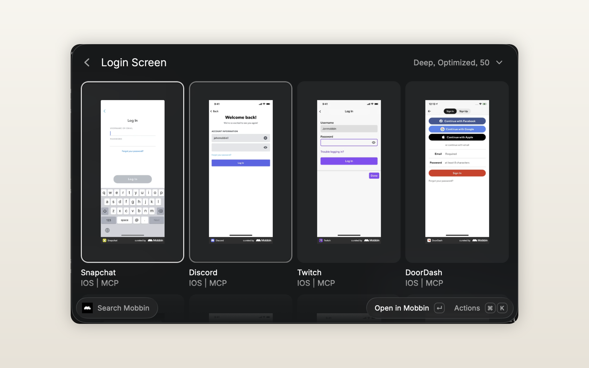

# Mobbin for Raycast

Search [Mobbin](https://mobbin.com) for screens, product flows, and website
sections without leaving Raycast.

> **Unofficial extension.** This community project is not affiliated with,
> endorsed by, or operated by Mobbin. “Mobbin” and the Mobbin logo belong to
> their respective owner. You use the extension with your own Mobbin account or
> API key.



## Features

- Debounced natural-language search across iOS and web references.
- Dedicated commands for screens, selected text, flows, and website sections.
- Ordered screen galleries for multi-step flows.
- OAuth MCP onboarding by default for new installations.
- REST API mode for existing Team and Enterprise integrations.
- Persistent favorites with local image copies and a 20-entry search history.
- Safe local image actions: download, copy, paste, Quick Look, and expiring-URL
  warnings.
- Immediate result metadata with progressively loaded images and large
  two-column reference grids.
- Deep and Standard search modes, configurable limits, and screen exclusions.

## Commands

| Command                    | Availability      | Description                                                                                            |
| -------------------------- | ----------------- | ------------------------------------------------------------------------------------------------------ |
| **Search Mobbin**          | REST or OAuth MCP | Search iOS and web screens.                                                                            |
| **Search Selected Text**   | REST or OAuth MCP | Use editable selected text as a screen query. Text over 500 characters is blocked before transmission. |
| **Search Mobbin Flows**    | OAuth MCP         | Search multi-step flows and open their ordered screens.                                                |
| **Search Mobbin Sections** | OAuth MCP         | Search website sections such as pricing pages and footers.                                             |

## Authentication and plans

New installations default to **OAuth MCP**. Existing installations keep their
stored authentication preference.

| Mode             | Mobbin plan              | Capabilities                                                                                                                                                                  |
| ---------------- | ------------------------ | ----------------------------------------------------------------------------------------------------------------------------------------------------------------------------- |
| **OAuth MCP**    | Pro, Team, or Enterprise | Screens, flows, and sections through Mobbin’s Streamable HTTP MCP server. Raycast handles OAuth, dynamic client registration, PKCE, refresh tokens, and secure token storage. |
| **REST API Key** | Team or Enterprise       | Screen search through `POST /v1/screens/search`. Mobbin’s documented REST API does not expose flows or sections.                                                              |

Choose the mode in the extension preferences. In OAuth mode, open any search
command and run **Connect Mobbin OAuth** from the action panel. To revoke the
server-side grant later, use **Manage or Revoke Mobbin Access** or visit
[Mobbin MCP settings](https://mobbin.com/settings/mcp). Local Disconnect removes
Raycast’s stored credentials but does not revoke the Mobbin-side grant.

Official references:
[Mobbin overview](https://docs.mobbin.com/),
[REST screen search](https://docs.mobbin.com/api-reference/screens/search-screens-with-natural-language),
[MCP integration](https://docs.mobbin.com/mcp/build-an-integration), and
[rate limits](https://docs.mobbin.com/rate-limits).

## Search and image behavior

Queries are trimmed and must contain 1–500 characters. Search starts 700 ms
after typing stops. Superseded requests are cancelled, successful results are
cached in memory for two minutes, and rate-limit responses are retried at most
three times while respecting `Retry-After`.

Mobbin image URLs can expire. The extension therefore separates three types of
files:

- Copy, paste, and Quick Look use an internal temporary cache.
- Adding a favorite stores a dedicated persistent local image when possible.
  The favorite is still retained if that download fails.
- **Download Image** creates a unique, sanitized file in `~/Downloads`.

Images must be served over HTTPS with an `image/*` content type and are limited
to 25 MB. Temporary cache files older than 30 days are pruned, with at most 200
nonfavorite files retained. Search and flow grids show all result metadata
immediately, then cache and reveal remote images one at a time. Changing the
query cancels the old image queue, while already cached images appear
immediately.

## Preferences

- **Authentication Mode** — OAuth MCP or REST API Key.
- **Mobbin API Key** — used only by REST mode.
- **Default Platform** — iOS or Web.
- **Default Search Mode** — Deep or Standard.
- **REST Image Quality** — Optimized or High.
- **MCP Image Format** — WebP or JPEG.
- **Default Result Limit** — 10, 20, 50, or 100. MCP requests are clamped to
  each advertised tool schema.

## Development

Requires macOS, Raycast, and a current Node.js LTS release.

```bash
npm ci
npm run typecheck
npm run eslint
npm run format:check
npm test
npm run lint
npm run build
```

The test fixtures contain only synthetic structural values. Never commit
Mobbin credentials, authorization parameters, signed URLs, or downloaded
reference images.

## License

[MIT](./LICENSE) © Niklas Schmidt
