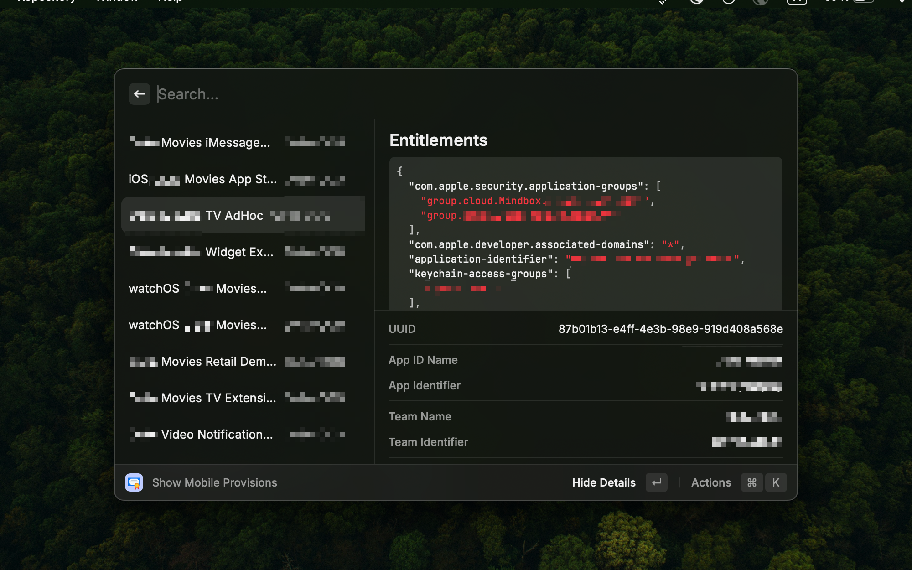

# Mobile Provisions

A Raycast extension that helps you manage and inspect Apple mobile provisioning profiles installed on your system. View detailed information about certificates, entitlements, provisioned devices, and more.

## Show Mobile Provisions

This command displays a comprehensive list of all installed .mobileprovision files from your `~/Library/MobileDevice/Provisioning Profiles` directory. The profiles are sorted by creation date, with the most recent ones appearing first.

### Key Actions:
- **Show Details** - Toggle between list view and detailed view with entitlements, certificates, team id, and more attributes
- **Show Devices** - View list of all provisioned devices (if any devices are included in the profile)
- **Remove All Expired Provisions** - Delete all expired profiles at once

## Dump Provision Profile

This command allows you to inspect a specific .mobileprovision file by providing its file path. It's useful for analyzing provisioning profiles that aren't installed in the standard location.

### Key Actions:
- **Show Devices** - View list of all provisioned devices (if any devices are included in the profile)

## Features

- **Smart Filtering** - Search through profiles by name, team, app ID, UUID, and provisioned devices
- **Expiration Tracking** - Expired profiles are clearly marked with a red "Expired" tag
- **Profile Type Indicators** - Visual color coding for different profile types (Development, Ad Hoc, App Store, Enterprise)
- **Platform Support** - Shows which platforms (iOS, macOS, watchOS, tvOS, visionOS) the profile supports
- **Certificate Details** - View developer certificates with expiration dates
- **Entitlements Inspector** - Examine all entitlements in JSON format
- **Device Management** - Browse and copy UDIDs of provisioned devices

