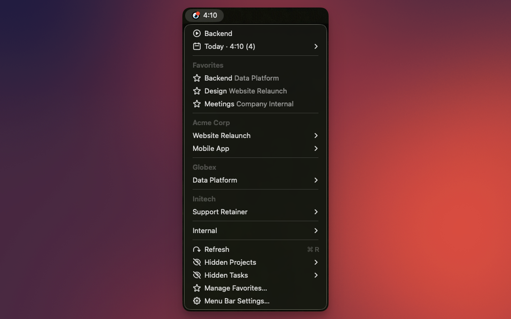

# MOCO

## Prerequisites

### URL Prefix
The prefix denoting your company in the MOCO URL (eg.: `yourcompany` if the url is `yourcompany.mocoapp.com`)
### MOCO API Key
Your personal API key. It can be retrieved at the following address: [https://yourcompany.mocoapp.com/profile/integrations](https://yourcompany.mocoapp.com/profile/integrations)

## Menu Bar

Today's timer, favorites and projects, right in the menu bar.

