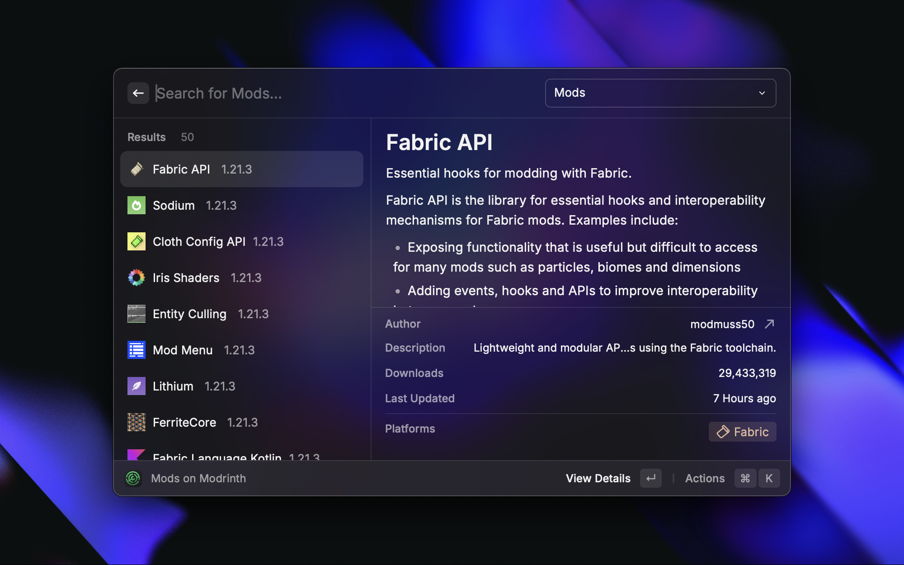
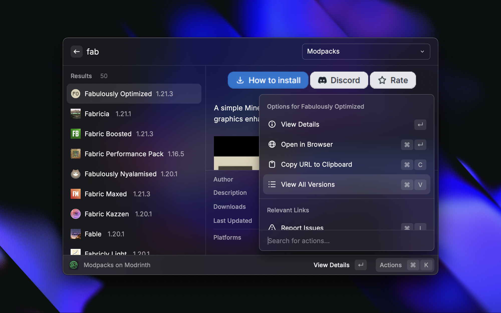
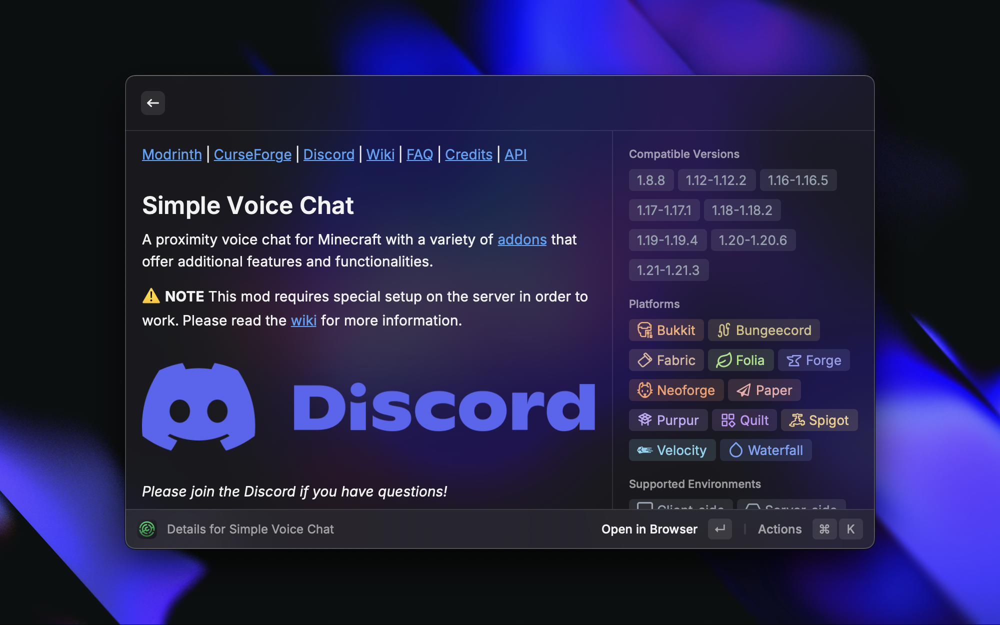
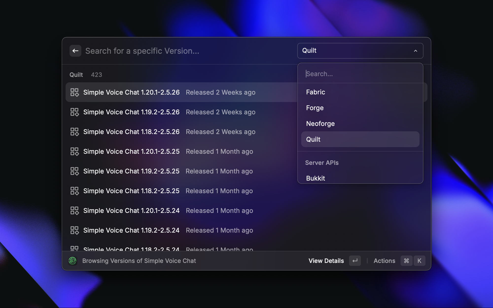

# Modrinth for Raycast

  

Search and manage Minecraft content directly through Raycast. Access Modrinth's extensive collection of mods, resource packs, plugins, and more without leaving your keyboard.

## Features

### 🔍 Universal Search
- Search across all Modrinth content types:
    - Mods
    - Resource Packs
    - Plugins
    - Data Packs
    - Modpacks
    - Shaders

### 💨 Quick Actions

  

- Download files directly
- Open in browser
- Copy project URLs
- Access source repositories
- Join project Discord communities
- Report issues
- View version history

### 📊 Detailed Project Information

  

- Comprehensive compatibility information
    - Supported Minecraft versions
    - Compatible mod loaders (Fabric, Forge, Quilt, etc.)
    - Client/Server support
- Download statistics
- Project descriptions and changelogs
- Author information

### 📦 Version Management

  

- Browse all project versions
- Filter by mod loader
- View version-specific changelogs
- Direct download links
- Release date information

## Installation

1. Install [Raycast](https://raycast.com)
2. Open Raycast Store
3. Search for "Modrinth"
4. Click Install

## Pro Tips

- Filter results by mod loader using the dropdown menu
- Use ⌘ + V to view all versions of a project
- Copy a projects URL to your clipboard with ⌘ + C
- Access source code with ⌘ + S and report issues with ⌘ + I
- Join project Discord or download a specific Version with ⌘ + D

## Author

Created with ❤️ by [@soradotwav](https://github.com/soradotwav)