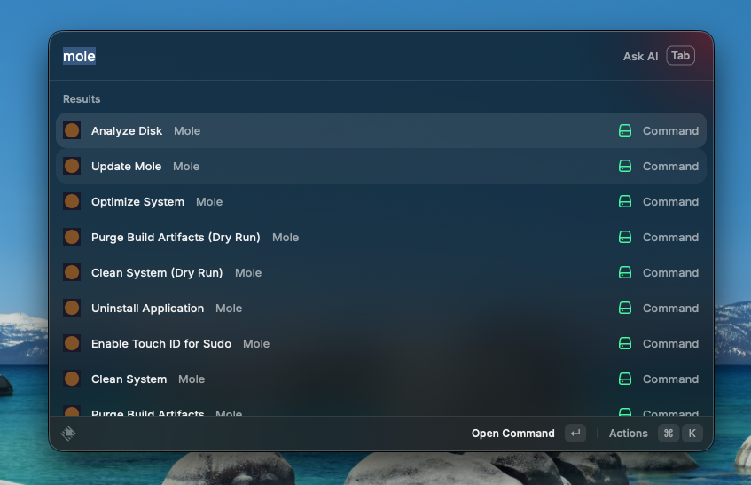

# Mole

A Raycast extension for [Mole](https://github.com/tw93/mole) — a comprehensive macOS system optimizer that combines the functionality of CleanMyMac, AppCleaner, DaisyDisk, and iStat Menus into a single CLI tool.



## Prerequisites

Install Mole via Homebrew:

```bash
brew install mole
```

Or via the install script:

```bash
curl -fsSL https://raw.githubusercontent.com/tw93/mole/main/install.sh | bash
```

## Commands

| Command | Description |
|---|---|
| **Clean System** | Deep system cleanup — removes caches, browser data, logs, and temporary files |
| **Clean System (Dry Run)** | Preview what would be cleaned without deleting anything |
| **Uninstall Application** | Smart app removal with associated files (preferences, launch agents, plugins) |
| **Optimize System** | Rebuild system databases, clear caches, reset network services, refresh Finder/Dock |
| **Optimize System (Dry Run)** | Preview optimization without making changes |
| **Analyze Disk** | Interactive disk space visualization with navigation (arrow keys, vim bindings) |
| **System Status** | Real-time CPU, GPU, memory, disk, and network monitoring dashboard |
| **Purge Build Artifacts** | Remove node_modules, target, build, dist directories from dev projects |
| **Purge Build Artifacts (Dry Run)** | Preview which build artifacts would be removed |
| **Find Installer Files** | Discover large .dmg, .pkg, .zip installer files across your system |
| **Enable Touch ID for Sudo** | Configure Touch ID authentication for sudo commands |
| **Update Mole** | Update Mole to the latest stable version |

## How It Works

Since Mole is an interactive TUI application, each command opens your preferred terminal and runs the corresponding `mo` subcommand. The extension auto-detects your terminal app in this order: Warp, Ghostty, Alacritty, kitty, WezTerm, Hyper, iTerm, Terminal.

## Troubleshooting

- **"Mole not found"** — Make sure Mole is installed and the `mo` binary is available at `/usr/local/bin/mo`, `/opt/homebrew/bin/mo`, or in your `$PATH`.
- **Terminal not opening** — The extension uses AppleScript to launch your terminal. Grant Raycast accessibility permissions in System Settings > Privacy & Security > Accessibility.
