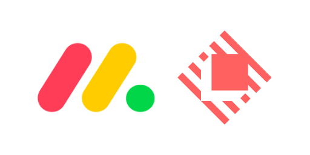
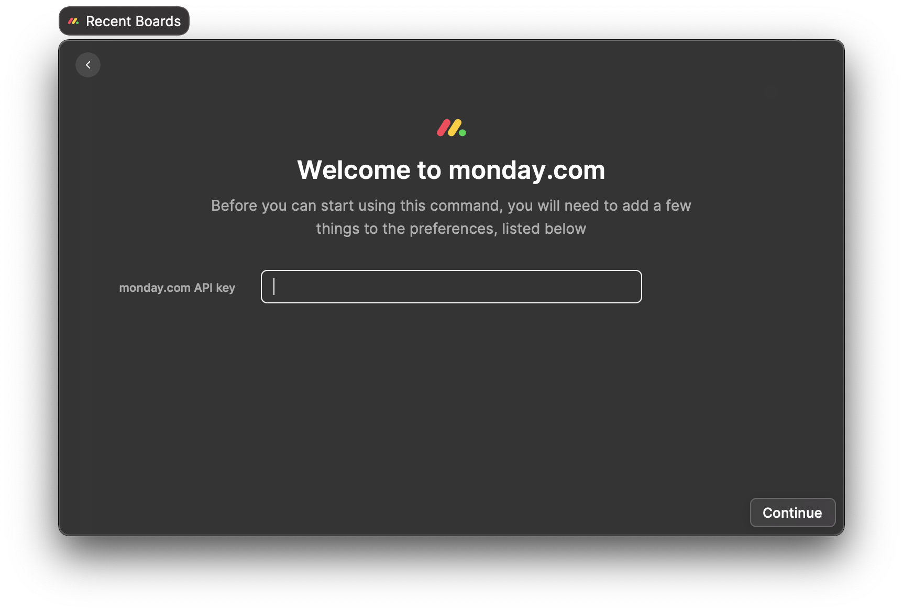

## monday.com Raycast Extension

To get started, you'll need to generate a personal monday.com API Token.

You can get a token by either:

1. Going to **https://{your-slug}.monday.com/apps/manage/tokens** and generating your token; or
2. Heading over to the **Developers** menu, and then pick **Developer ▶ My Access Tokens** from the top menu.
