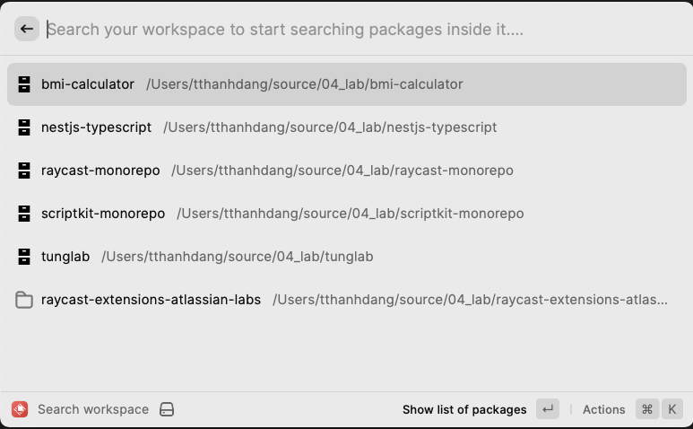

## Intro about Raycast Monorepo

This Raycast Monorepo is an extension which is installed in [Raycast](https://www.raycast.com/).

### Workspace List view

This extension will scan all direct folders in `rootSourceFolder` (configured in the extension preferences) folder and show them like this:



Each folder is considered a project or workspace if it has a `package.json` file at the root. Otherwise, it is considered a normal folder.

- Only a workspace has a special action `Show List of Packages`. A normal folder does not have this action.
- Only a package has this special action `See Package Details` that allows to see details of selected pacakge.

### Package List view

When you select a workspace, it shows list of packages of selected workspace.

---

## All actions

A worksapce, normal folder and package have these common actions:

### Actions related to editors

- `Open in Visual Studio Code`: open selected workspace/folder/package in Visual Studio Code Text editor.
- `Open in Sublime Text`: open selected workspace/folder/package in Sublime Text editor.

### Common actions

- `Open in Finder`: : open selected workspace/folder/package in Finder.
- `Copy Path`: copy path of selected workspace/folder/package.
- `Open in Terminal`: open selected workspace/folder/package in Terminal app.
- `Open With...`: open selected workspace/folder/package in any applications.
- `Open Remote URL`: open remote git URL of selected workspace/folder/package in browser.

### Actions if a package has a team information

- `Open Jira Project Link`: open a Jira project of the selected package if it is avaiable.
- `Open Slack Channel`: open a Slack Channel of a team owning the selected package if it is avaiable.

### Uncommon actions

- `Submit Feedback`: open a Github link which users can submit feedback / questions / issues.
- `Clear Cache`: clear cached to load the latest updates.
- `Trash`: remove folder of workspace/folder/package.

### Package Detail view

When you select a package and then choose `See package detail` action. The next view will show details of selected package. In addition, it also show content of `README.md` file of selected package if it is available.

If you follow next section to setup `teams.json` file, the Package Detail view can show team information who owns the selected package.

## Extension preferences

- `rootSourceFolder`: (required) a folder path where the extension scans all direct sub-folders and detect them as monorepo workspace or a normal folder. We don't support a deep scanning at this moment.
- `cacheDuration`: (optional) we use caches to improve performance of showing results. Default duration of caching is 86400000MS = 1 day.
- `slackRedirectLink`: (optional) a URL has this structure `https://<your-workspace>.slack.com/app_redirect?channel={query}`. It is used to open Slack channel of a team owning a package.
- `mainFieldName`: (optional) a field name in `package.json` file containing team name who owns a package. If the field name is not specified, some detail info of current package will be omitted

---

## How to setup `teams.json`

1. Create a file `teams.json` at root folder of a workspace/prject. The `teams.json` file is considered as file databse containg all teams. It has this structure

```json
// in `teams.json` file

{
  "team-name-a": {
      "contributors": [
          "contributor-a",
          "contributor-b",
          ...
      ],
      "directly-responsible-individual": "person-name-a",
      "project": "https://<your-company>.atlassian.net/jira/software/projects/<your-project-key>/boards/<your-board-id>",
      "slack": "#slack-channel-name",
  },
  "team-name-b": {
    // same as above
  }
}
```

2. In `package.json` file in a single package/workspace, there should be a field to specify a team owning that package

```json
// in `package.json` file

{
  "name": "<package-name-a>",
  "version": "1.0.0",
  "dependencies": {
    ...
  },
  "devDependencies": {
    ...
  },
  "<mainFieldName>": {
      "team": "team-name-a",
  }
}

```

`mainFieldName` is configured in this Raycast extension preferrences. So the Package Detail view can use this field to look up team information in `teams.json` file.

---

## Development

1. Install this [Raycast VSCode extension](https://marketplace.visualstudio.com/items?itemName=tonka3000.raycast)
2. In VSCode, press `Cmd + Shift + P` -> choose `Raycast: Start Development Mode`
3. Now you can follow this [Raycast document](https://developers.raycast.com/basics/debug-an-extension) for debugging.

---

## Feedback

- Please raise your question / feedback on [Github Issue page](https://github.com/tung-dang/raycast-monorepo-manager/issues)
