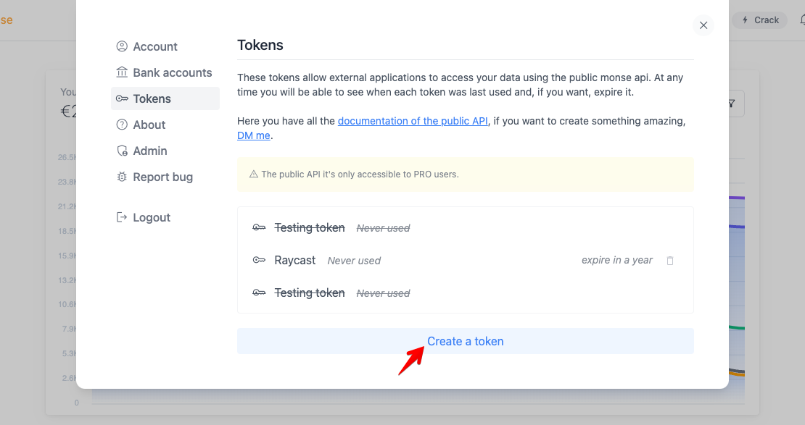

# monse
Connect your bank account and see the latest transactions and details.

## 1. How to configure this extension
To use this extension we need a Public API Token. You can get this token from your account at [monse.app](https://monse.app).
   

1. Go to settings in the top right corner.
2. Go to Tokens and create a new one.
3. You need to copy this token because it will only be displayed once. This token has a duration of one year. After this period a new one will have to be generated.
