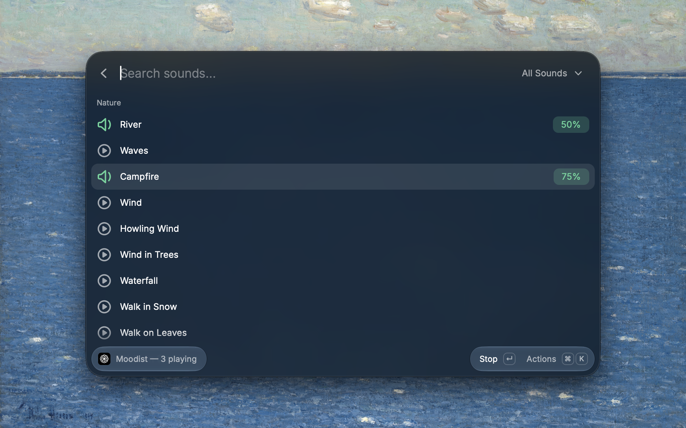
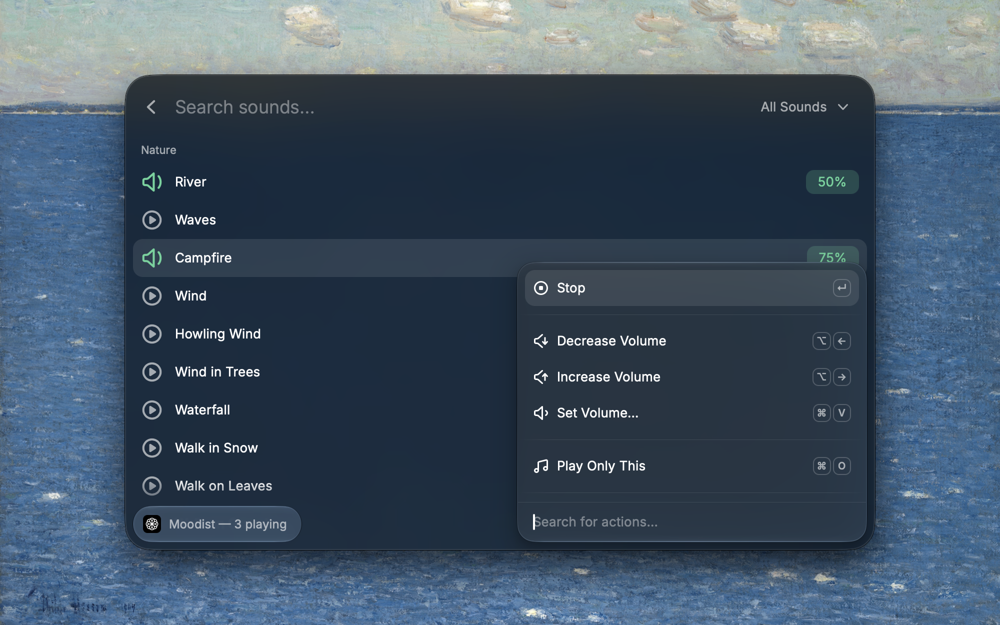

     
     
    
    <h3>Moodist</h3>
    
Ambient sound mixer for focus and relaxation

     
     

Moodist is a Raycast extension that layers nature, rain, city, and noise sounds into a mix and keeps presets, a sleep timer, and menu bar controls so you can focus or wind down and leave it playing.

## Features

- **89 sounds in 9 categories.** Search by name, or filter by category or by what is in the mix
- **Mix multiple sounds.** Play a sound on its own, or add it to the current mix. A new sound starts at the Default Volume preference (50% unless you change it)
- **Volume.** Each sound moves in 5% steps between 10% and 100%, or jumps to 10%, 25%, 50%, 75%, or 100%. A master volume scales the whole mix
- **Pause and resume.** Pausing keeps the mix, so you can pick up where you left off from the mixer, the menu bar, or Toggle Playback
- **Presets.** Save the current mix, then load, rename, overwrite, or delete it. Saved mixes also appear in the menu bar
- **Sleep timer.** Pause the mix after 15 minutes up to 2 hours, or after a custom number of minutes up to 24 hours. It fires even when Raycast is closed
- **Menu bar.** Pause, resume, change a sound's volume, remove a sound, load a preset, or cancel the timer without opening Raycast
- **AI.** Ask Raycast AI to play sounds, stop them, or play a saved preset, for example "@moodist play my Focus preset"
- **Background playback.** Sounds keep playing after you close Raycast. Each file downloads on first play and stays cached

## Mix Sounds

Sounds that still need to be fetched show a download icon. Playing sounds show their volume in green, and paused sounds in orange.

| Action                  | Shortcut |
| ----------------------- | -------- |
| Play, resume, or stop   | ↵        |
| Decrease volume         | ⌥←       |
| Increase volume         | ⌥→       |
| Set volume              | ⌘V       |
| Play only this          | ⌘O       |
| Pause or resume the mix | ⌘⇧P      |
| Master volume           | ⌘M       |
| Save mix as preset      | ⌘S       |
| Stop all                | ⌃⇧X      |

**Play only this** clears the rest of the mix and plays the selected sound.

## Presets

Save the current mix under a name. Each preset keeps the sounds, their volumes, and the master volume. Load one to replace what is playing, rename it, overwrite it with the current mix, or delete it. Names must be unique, ignoring case.

- **Order.** Pinned presets come first (⌘⇧P), then the ones you used most recently. The menu bar shows the first 10 in the same order
- **Status.** The preset that matches the current mix shows **Playing** or **Paused**. If you change the mix after loading a preset, it shows **Modified** until you reload it or load another
- **Hotkeys.** Run **Play Preset** with a preset name, or use **Create Quicklink** (⌘⇧L) in Manage Presets and assign the quicklink a hotkey or alias in Raycast settings. Quicklinks keep working after you rename the preset

## Sleep Timer

Pick a duration or enter a custom number of minutes. When the timer ends, the mix pauses. The menu bar shows the time left and can cancel the timer.

## Commands

| Command          | Description                               |
| ---------------- | ----------------------------------------- |
| Mix Sounds       | Browse, play, and mix sounds              |
| Toggle Playback  | Pause or resume the current mix           |
| Manage Presets   | Save, load, pin, rename, and delete mixes |
| Play Preset      | Play a saved preset by name               |
| Set Sleep Timer  | Pause the mix after a set time            |
| Moodist Menu Bar | Menu bar controls                         |
| Stop All Sounds  | Stop every sound and clear the mix        |

## Sound Categories

- **Nature.** River, Waves, Campfire, Wind, Howling Wind, Wind in Trees, Waterfall, Walk in Snow, Walk on Leaves, Walk on Gravel, Droplets, Jungle
- **Rain.** Light Rain, Heavy Rain, Thunder, Rain on Window, Rain on Car Roof, Rain on Umbrella, Rain on Tent, Rain on Leaves
- **Animals.** Birds, Seagulls, Crickets, Wolf, Owl, Frog, Dog Barking, Horse Gallop, Cat Purring, Crows, Whale, Beehive, Woodpecker, Chickens, Cows, Sheep
- **Urban.** Highway, Road, Ambulance Siren, Busy Street, Crowd, Traffic, Fireworks
- **Places.** Cafe, Airport, Church, Temple, Construction Site, Underwater, Crowded Bar, Night Village, Subway Station, Office, Supermarket, Carousel, Laboratory, Laundry Room, Restaurant, Library
- **Transport.** Train, Inside a Train, Airplane, Submarine, Sailboat, Rowing Boat
- **Things.** Keyboard, Typewriter, Paper, Clock, Wind Chimes, Singing Bowl, Ceiling Fan, Dryer, Slide Projector, Boiling Water, Bubbles, Tuning Radio, Morse Code, Washing Machine, Vinyl Effect, Windshield Wipers
- **Noise.** White Noise, Pink Noise, Brown Noise
- **Binaural Beats.** Delta, Theta, Alpha, Beta, Gamma

## Upgrading From Earlier Versions

Saved presets carry over. Their sounds are matched to the new catalog, for example Rain becomes Light Rain and Coffee Shop becomes Cafe. Deep Space has no match and is dropped from any preset that used it. The Keep Alive background command is gone, because sounds no longer need restarting.

## Sound Credits

Sounds come from the [Moodist](https://github.com/remvze/moodist) project by remvze and download from [moodist.mvze.net](https://moodist.mvze.net). Moodist sources them from third parties under different licenses: some are under the [Pixabay Content License](https://pixabay.com/service/license-summary/) and others under [CC0](https://creativecommons.org/publicdomain/zero/1.0/).
