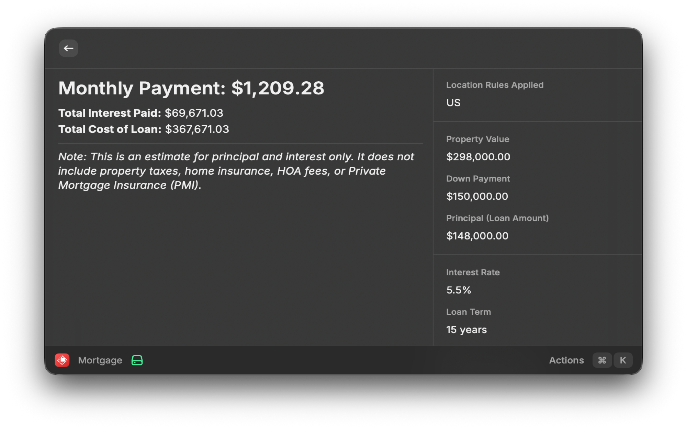

# Mortgage Calculator for Raycast

Calculate your mortgage payments instantly from Raycast! This extension provides a sleek interface to estimate your monthly payments, supporting common United States mortgage types and various international compounding calculation methods.

## Features

- **Quick Calculations**: Estimate your monthly payments, total interest, and the total cost of your loan instantly without leaving your keyboard.
- **Support for Multiple Loan Types**: Supports standard Principal & Interest amortized loans, as well as Interest-Only loans.
- **International Compounding Support**: Built-in support for the mathematical compounding differences between countries:
  - **US / UK**: Standard monthly compounding.
  - **Canada**: Semi-annual compounding.
  - **Australia**: Daily compounding.
- **Flexible Down Payments**: Input down payment as either a percentage (`%`) or a fixed dollar amount (`$`).

## Setup

1. **Location Preference**: Upon installing the extension, open your Raycast settings, navigate to the Extensions tab, find "Mortgage Calculator", and set your "Location". This ensures the math perfectly matches your country's standard loan calculation model.

## Usage

1. Open Raycast and search for **"Calculate Mortgage"**.
2. Enter your **Property Value**.
3. Select your **Down Payment Type** (Percentage or Amount) and enter the value.
4. Input your **Interest Rate** (e.g., `5.5` for 5.5%).
5. Select the **Loan Term** (15, 20, 30, or 40 years).
6. Check **Interest-Only Loan** if applicable.
7. Hit **Enter** to calculate. You will instantly see a detailed breakdown of your calculated mortgage, including the Monthly Payment front-and-center, Total Interest, and Total Cost.

> **Important Note:** This tool provides an *estimate* of your Principal and Interest (P&I) payments. It does **not** include escrow items such as Property Taxes, Homeowners Insurance, Homeowners Association (HOA) Fees, or Private Mortgage Insurance (PMI). Always consult with a licensed professional for exact quotes.