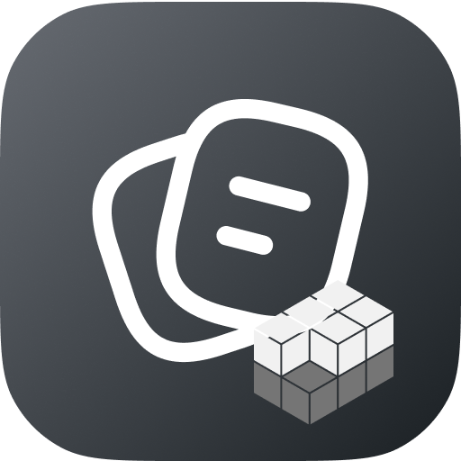

  
  <h1 align="center">Mound, from Pile</h1>

A Raycast extension to save ideas at the speed of thought.

This is an extension for reflective journaling. It's about simplicity and keeping keeping your data local.

This extension is built on top of [Pile](https://github.com/UdaraJay/pile) by Udara Jay. This extension is built to integrate with the Pile app. It can also be used as a standalone app.
