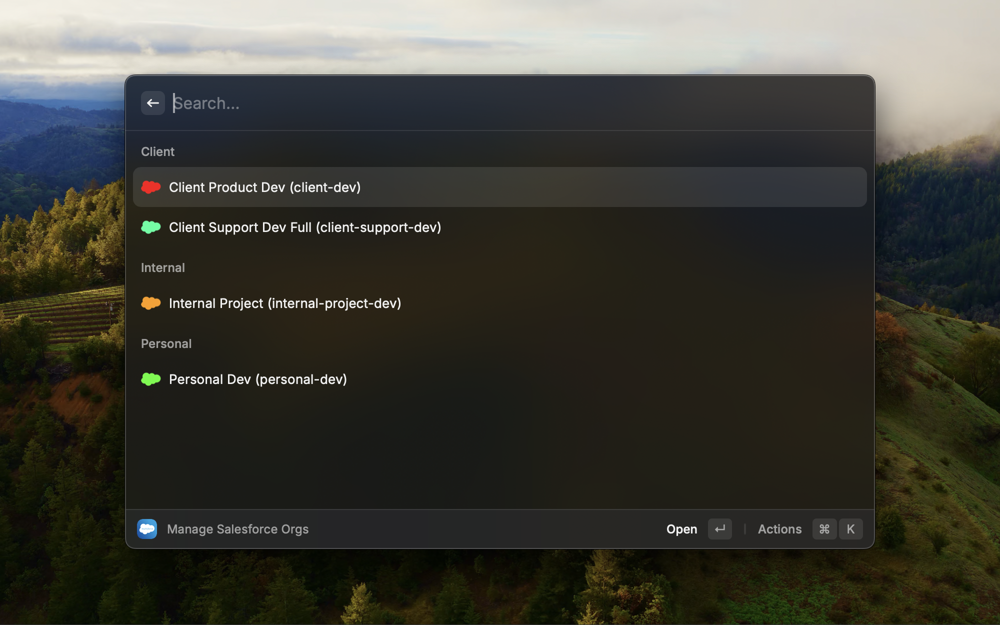

# MultiForce

MultiForce is an extension for the Raycast search tool on Mac. MultiForce uses the Salesforce Core and CLI plugins npm packages to interface with the logic behind the `sf org` commands, allowing developers to authenticate, login into, and log out of their Salesforce orgs.

## Viewing Your Orgs



Opening MultiForce shows you a list of all Salesforce orgs you have authenticated into. This list comes from the same source file as the `sf org list` CLI command, meaning that all Salesforce Orgs you use in VSCode are also available in MultiForce.


## Actions

| Shortcut    | Action |
| -------- | ------- |
| ⌘ Enter  | Authenticate and open the selected org in your browser  |
| ⌘ D | Delete the selected org from your list. (Note, this will also remove it as an org from the SF command and VSCode)     |
| ⌘ R  | Refresh your org list. Use this if you authenticate into an org through VSCode    |
| ⌘ N | Add a new Salesforce Org to your list |

## How To Install

### Download and Install Raycast

To install MultiForce, you first need to have downloaded and setup [Raycast](https://www.raycast.com/), a spotlight search replacement tool. When you set Raycast up, it is recommended that you re-bind `⌘ + Space` in settings to use Raycast instead of the default spotlight search on Mac. [Instructions](https://manual.raycast.com/hotkey)

### Install MultiForce

> [!WARNING]
> MultiForce is still under review on the Raycast app store. Until they approve it, please look at the instructions to install the Beta.

To install the production version of MultiForce, open the Store in Raycast and search for MultiForce. Select Install.

### Install MultiForce (Beta)

To install the beta version of MultiForce, open a terminal and run the following commands.

```bash
git clone https://github.com/Decoder22/MultiForce.git
cd MultiForce/
npm install
npm run dev
```

Now, you can open Raycast and search for `MultiForce` and it will be installed on your computer.