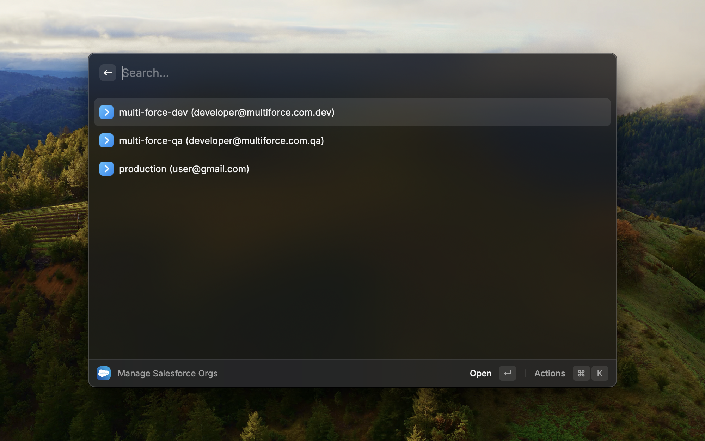

# MultiForce

MultiForce is an extension for the Raycast search tool on Mac. MultiForce uses the Salesforce Core and CLI plugins npm packages to interface with the logic behind the `sf org` commands, allowing developers to authenticate, login into, and log out of their Salesforce orgs.

## Viewing Your Orgs

Opening MultiForce shows you a list of all Salesforce orgs you have authenticated into. This list comes from the same source file as the `sf org list` CLI command, meaning that all Salesforce Orgs you use in VSCode are also available in MultiForce.

## Actions

| Shortcut    | Action |
| -------- | ------- |
| ⌘ Enter  | Authenticate and open the selected org in your browser  |
| ⌘ D | Delete the selected org from your list. (Note, this will also remove it as an org from the SF command and VSCode)     |
| ⌘ R  | Refresh your org list. Use this if you authenticate into an org through VSCode    |
| ⌘ N | Add a new Salesforce Org to your list |
