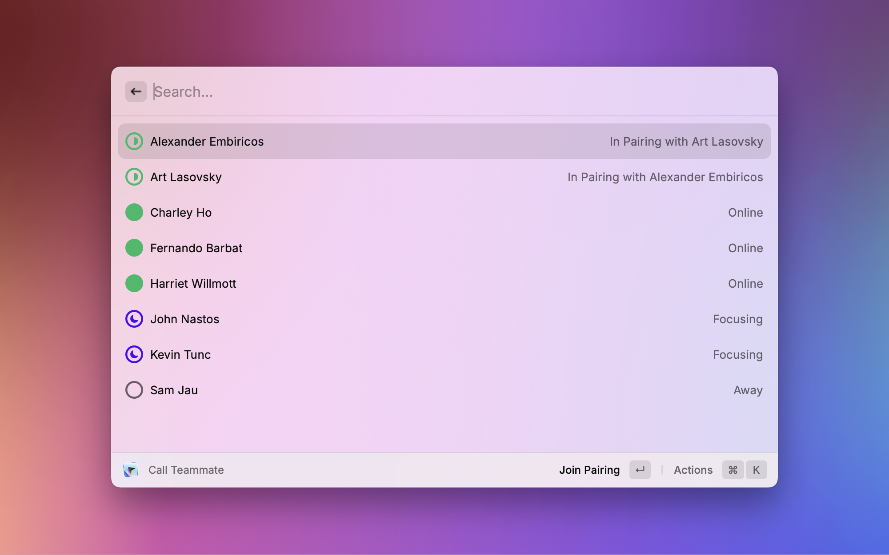

  

  <h1>
    Multi
  </h1>

Raycast extension to see rooms & teammates, join sessions, control devices and more.

  

    
    
    
    
  

## Features

- Start new sessions, or join via URL
- List teammates and invite them to sessions
- List and join rooms
- Copy a new session link to paste into a calendar invite
- During a session:
  - Toggle camera
  - Toggle microphone
  - Toggle shared content
  - Copy a link to the current session
- And more…

## Setup

- Download and login to Multi from https://multi.app
- Enable macOS Automation permissions for Raycast

## Showcases

### Start New Session

### Call Teammates

### Join Rooms

