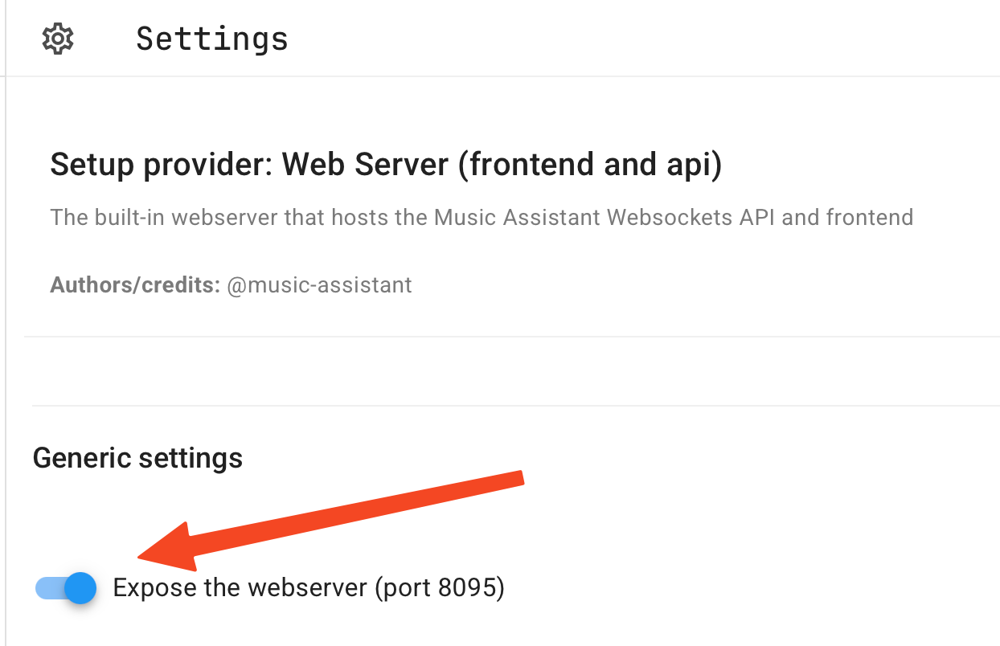
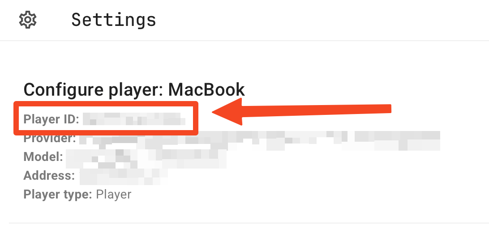

# 🎵 Music Assistant Raycast Extension

Control [Music Assistant](https://github.com/music-assistant/server) from anywhere on macOS and keep the current track in your Raycast menu bar.

---

## Features

| Command                    | What it does                                              |
| -------------------------- | --------------------------------------------------------- |
| **Toggle**           | Pauses/resumes playback on the selected player                   |
| **Next / Previous**        | Skips tracks                                              |
| **Menu Bar Player**        | Displays title - artist in the macOS menu bar          |

Works with:

- A standalone Music Assistant server (`ws://HOST:8095/ws`)
- The Home Assistant add-on (just expose port `8095` in the add-on’s settings)

## Configuration
| Parameter   | Description                                                                                   |
|-------------|-----------------------------------------------------------------------------------------------|
| `host`      | Local Music Assistant IP address (use the direct IP; mDNS is not reliable in the Raycast environment) |
| `playerId`  | The player ID as displayed by Music Assistant (see image below)                               |

