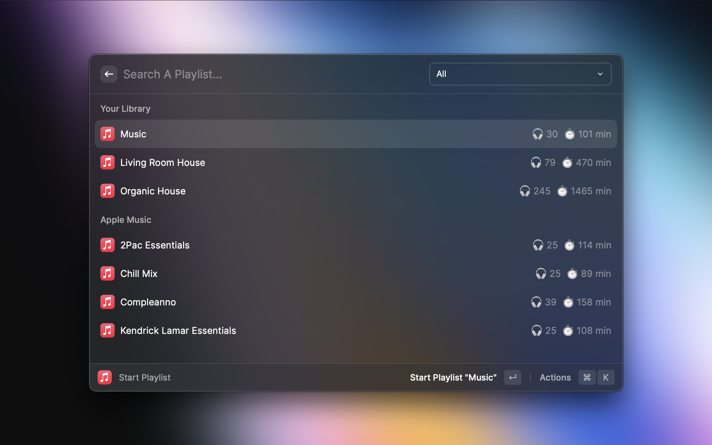
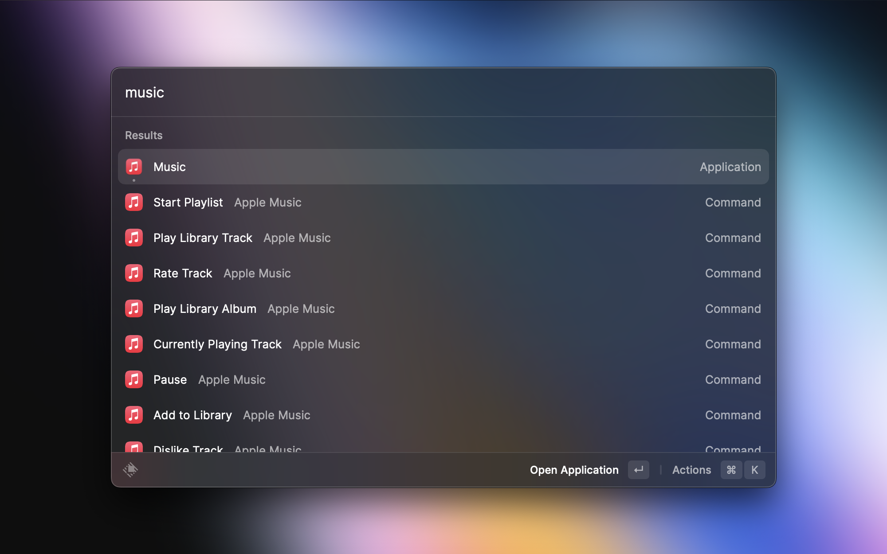

	

# Music

> Apple music extension

## Troubleshooting

- Enable **Start Playlist** in Raycast Settings → Extensions → Music. It is disabled by default.
- Use **Favorite Track** to add a song to Music's automatically managed Favorite Songs playlist.
- Music may not expose a station's current track to AppleScript. If Add to Playlist cannot access it, add the song in Music first.
- If **Add to Library** creates an entry with an incorrect date or does not sync it to your cloud library, use **Search Apple Music** and its **Add to Library** action. That command uses the Apple Music API and requires sign-in. The current-track shortcut still uses Music's AppleScript duplication command.
- If Music stops responding after sleep, reopen Music and retry. Script timeouts prevent indefinite waits but cannot repair Music's internal state.

## Development

Run `npm test`, `npx tsc --noEmit`, `npm run build`, and `npm run lint`.
The regression suite covers subprocess handling, search ranking, metadata parsing, and generated scripts. Playback, cloud sync, and station behavior also need testing in Raycast with Music on macOS.
